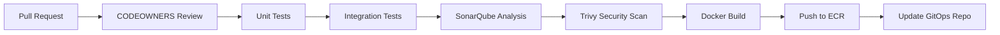

# CloudInsight Architecture Documentation


This document provides a comprehensive overview of the CloudInsight microservices architecture, including both the CI/CD pipeline and the cloud infrastructure design. The architecture is designed for high availability, scalability, and security across three environments: Development, Staging, and Production.

## 📋 Table of Contents

- [CI/CD Pipeline Architecture](#cicd-pipeline-architecture)
- [Infrastructure Architecture](#infrastructure-architecture)
- [Technology Stack](#technology-stack)
- [Environment Strategy](#environment-strategy)
- [Security Considerations](#security-considerations)
- [Monitoring and Observability](#monitoring-and-observability)

---

## 🚀 CI/CD Pipeline Architecture


_[View Full CI/CD Architecture](./cicd-architecture.png)_

The CloudInsight project implements a modern GitOps-based CI/CD pipeline with clear separation of concerns between Continuous Integration (CI) and Continuous Deployment (CD).

### CI Pipeline (GitHub Actions)

The Continuous Integration pipeline is triggered on **Pull Requests** and must pass all checks before merging:

#### 🔍 **Quality Gates**

1. **Code Review**: Requires approval from CODEOWNERS
2. **Unit Tests**: Executes comprehensive unit test suites
3. **Integration Tests**: Validates service interactions
4. **Code Quality**: SonarQube analysis for code quality metrics
5. **Security Scanning**: Trivy vulnerability scanning
6. **Build & Push**: Docker image build and push to AWS ECR

#### 📊 **CI Pipeline Flow**



### CD Pipeline (ArgoCD)

The Continuous Deployment is managed by **ArgoCD** following GitOps principles:

#### 🎯 **GitOps Workflow**

1. **Image Version Update**: CI pipeline updates image tags in GitOps repository
2. **ArgoCD Detection**: ArgoCD monitors GitOps repo for changes
3. **Automatic Sync**: ArgoCD syncs changes to target environment
4. **Health Monitoring**: Continuous health checks on deployed services
5. **Slack Notifications**: Deployment status updates sent to Slack channels

#### 🏗️ **ArgoCD Features**

- **Multi-Environment Management**: Separate ArgoCD applications for dev/staging/prod
- **Rollback Capabilities**: One-click rollback to previous versions
- **Drift Detection**: Identifies configuration drift from Git source
- **Progressive Deployment**: Supports blue-green and canary deployments

---

## 🏗️ Infrastructure Architecture


_[View Full Infrastructure Architecture](./infra-architecture.png)_

The CloudInsight infrastructure is built on AWS using a multi-tier, multi-AZ architecture for high availability and fault tolerance.

### 🌐 Network Architecture

#### **VPC Design**

- **CIDR Block**: `10.0.0.0/16`
- **Multi-AZ Deployment**: 2 Availability Zones for redundancy
- **Subnet Strategy**:
  - **Public Subnets**: `10.0.1.0/24`, `10.0.2.0/24` (NLB, NAT Gateway)
  - **Private Subnets**: `10.0.11.0/24`, `10.0.12.0/24` (EKS Nodes)

#### **Traffic Flow**

```
Internet → Route53 → WAF → NLB → NGINX Ingress → Services
```

### 🔒 Security Layer

#### **AWS Security Services**

- **AWS WAF**: Web Application Firewall with DDoS protection
- **AWS Shield**: Advanced DDoS protection
- **Route 53**: DNS management with health checks
- **AWS Secrets Manager**: Secure secret storage and rotation

#### **Certificate Management**

- **Cert-Manager**: Automated TLS certificate provisioning
- **Let's Encrypt**: Free SSL/TLS certificates
- **NGINX Ingress**: TLS termination and routing

### ☸️ Kubernetes Layer (EKS)

#### **Cluster Configuration**

- **EKS Version**: Latest stable version
- **Node Groups**: Multi-AZ deployment across private subnets
- **Pod Security**: Pod Security Standards enforcement
- **Network Policy**: Kubernetes Network Policies for micro-segmentation

#### **Core Services**

##### **Application Services**

| Service                  | Purpose                          | Database       | Messaging |
| ------------------------ | -------------------------------- | -------------- | --------- |
| **Frontend**             | User Interface                   | -              | -         |
| **User Service**         | Authentication & User Management | PostgreSQL RDS | -         |
| **Cost Service**         | Cost Analysis & Optimization     | DocumentDB     | Kafka     |
| **Metric Service**       | Performance Metrics Collection   | DocumentDB     | Kafka     |
| **Anomaly Service**      | Anomaly Detection & Alerting     | DocumentDB     | Kafka     |
| **Forecast Service**     | Predictive Analytics             | DocumentDB     | Kafka     |
| **Notification Service** | Multi-channel Notifications      | DocumentDB     | Kafka     |

##### **Platform Services**

| Service              | Purpose                          | Technology                |
| -------------------- | -------------------------------- | ------------------------- |
| **API Gateway**      | Request Routing & Rate Limiting  | Kong/Ambassador           |
| **Config Service**   | Centralized Configuration        | Spring Cloud Config       |
| **NGINX Ingress**    | Load Balancing & TLS Termination | NGINX                     |
| **ArgoCD**           | GitOps Continuous Deployment     | ArgoCD                    |
| **External Secrets** | Secret Synchronization           | External Secrets Operator |

### 🗄️ Data Tier

#### **Database Strategy**

- **PostgreSQL RDS**: Multi-AZ deployment for User Service
  - Automated backups and point-in-time recovery
  - Read replicas for performance optimization
- **Amazon DocumentDB**: MongoDB-compatible for microservices
  - Multi-AZ cluster deployment
  - Automated backup and restore
  - Support for Cost, Metric, Anomaly, and Forecast services

#### **Message Streaming**

- **Amazon MSK (Kafka)**: Multi-AZ Kafka cluster
  - 3 brokers across availability zones
  - Automatic scaling and monitoring
  - Used for asynchronous inter-service communication

### 🔧 Infrastructure Services

#### **Container Management**

- **Amazon ECR**: Private container registry
  - Vulnerability scanning enabled
  - Lifecycle policies for image management
  - Cross-region replication

#### **Networking**

- **Network Load Balancer**: High-performance L4 load balancing
- **Single NAT Gateway**: Cost-optimized outbound internet access
- **Internet Gateway**: Inbound internet connectivity

#### **Storage**

- **Amazon S3**: Object storage for backups and artifacts
  - Versioning and lifecycle policies
  - Cross-region replication for disaster recovery

---

## 🛠️ Technology Stack

### **Infrastructure**

| Component                   | Technology | Purpose                       |
| --------------------------- | ---------- | ----------------------------- |
| **Cloud Provider**          | AWS        | Primary cloud platform        |
| **Container Orchestration** | Amazon EKS | Kubernetes cluster management |
| **Container Registry**      | Amazon ECR | Docker image storage          |
| **Load Balancer**           | AWS NLB    | Traffic distribution          |
| **Ingress Controller**      | NGINX      | Application routing           |

### **Data & Messaging**

| Component               | Technology        | Purpose                    |
| ----------------------- | ----------------- | -------------------------- |
| **Relational Database** | PostgreSQL RDS    | User data storage          |
| **Document Database**   | Amazon DocumentDB | Microservices data         |
| **Message Streaming**   | Amazon MSK        | Event-driven communication |
| **Caching**             | Redis ElastiCache | Performance optimization   |

### **DevOps & Monitoring**

| Component             | Technology              | Purpose                  |
| --------------------- | ----------------------- | ------------------------ |
| **CI/CD**             | GitHub Actions + ArgoCD | Automated deployment     |
| **GitOps**            | ArgoCD                  | Declarative deployments  |
| **Monitoring**        | Prometheus + Grafana    | Metrics and dashboards   |
| **Logging**           | AWS CloudWatch          | Centralized logging      |
| **Security Scanning** | Trivy                   | Vulnerability assessment |

---

## 🌍 Environment Strategy

### **Environment Isolation**

Each environment (Development, Staging, Production) maintains complete resource isolation:

#### **Shared Resources**

- Route 53 Hosted Zone (with environment subdomains)
- ECR Container Registry
- S3 Buckets (with environment prefixes)

#### **Environment-Specific Resources**

- Dedicated EKS clusters
- Separate RDS and DocumentDB instances
- Independent MSK clusters
- Isolated VPCs with separate subnets
- Environment-specific security groups

### **Environment Configuration**

| Environment     | Domain                     | Purpose                         | Scaling                   |
| --------------- | -------------------------- | ------------------------------- | ------------------------- |
| **Development** | `dev.cloudinsight.com`     | Feature development and testing | Minimal resources         |
| **Staging**     | `staging.cloudinsight.com` | Pre-production validation       | Production-like resources |
| **Production**  | `prod.cloudinsight.com`    | Live customer traffic           | Full scaling capabilities |

---

## 🔐 Security Considerations

### **Network Security**

- **Private Subnets**: All application components in private subnets
- **Security Groups**: Least-privilege access rules
- **NACLs**: Additional network-level security
- **VPC Flow Logs**: Network traffic monitoring

### **Application Security**

- **Pod Security Standards**: Kubernetes security policies
- **Service Mesh**: Istio for service-to-service encryption
- **RBAC**: Role-based access control
- **Secret Management**: AWS Secrets Manager integration

### **Data Security**

- **Encryption at Rest**: All databases encrypted
- **Encryption in Transit**: TLS for all communications
- **Backup Encryption**: Encrypted backups and snapshots
- **Key Management**: AWS KMS for key rotation

---

## 📊 Monitoring and Observability

### **Metrics Collection**

- **Prometheus**: Kubernetes and application metrics
- **Grafana**: Visualization and dashboards
- **AWS CloudWatch**: Infrastructure metrics and logs

### **Alerting Strategy**

- **Prometheus AlertManager**: Rule-based alerting
- **Slack Integration**: Real-time notifications
- **PagerDuty**: Critical incident escalation

### **Logging Architecture**

- **Centralized Logging**: AWS CloudWatch Logs
- **Log Aggregation**: Fluent Bit for log forwarding
- **Log Analysis**: CloudWatch Insights for querying

### **Health Monitoring**

- **Kubernetes Probes**: Liveness and readiness checks
- **Service Monitors**: Prometheus service discovery
- **Infrastructure Health**: AWS Health Dashboard integration

---

## 🚀 Getting Started

To deploy this architecture:

1. **Prerequisites Setup**: Configure AWS CLI and kubectl
2. **Infrastructure Deployment**: Deploy using Terraform/CDK
3. **EKS Cluster Setup**: Configure cluster and node groups
4. **ArgoCD Installation**: Deploy GitOps controller
5. **Application Deployment**: Deploy microservices via ArgoCD

For detailed deployment instructions, see the [DevOps Repository Setup](../dev-repo-setup/README.md).

---

## 📚 Additional Resources

- [AWS EKS Best Practices](https://aws.github.io/aws-eks-best-practices/)
- [ArgoCD Documentation](https://argo-cd.readthedocs.io/)
- [Kubernetes Security Best Practices](https://kubernetes.io/docs/concepts/security/)
- [AWS Well-Architected Framework](https://aws.amazon.com/architecture/well-architected/)

---

_This architecture is designed to be scalable, secure, and maintainable while following cloud-native best practices._
