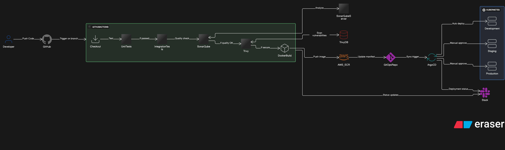
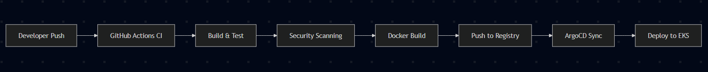
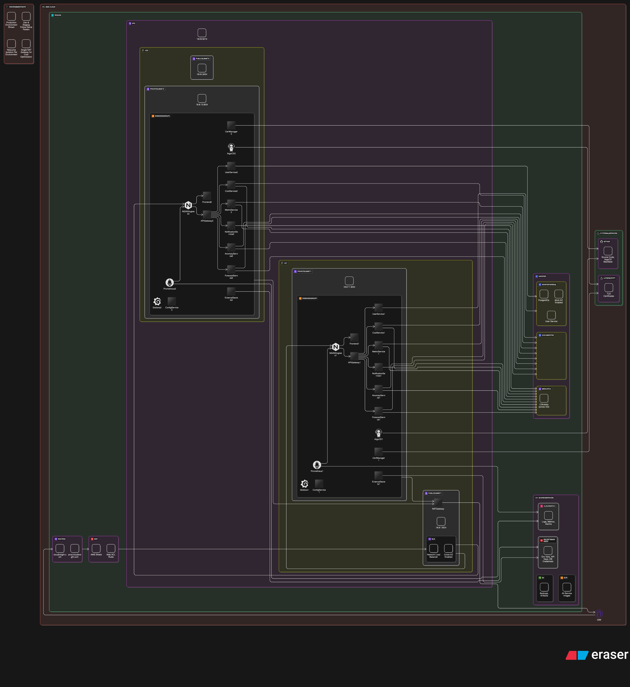

# CloudInsight Architecture Documentation


This document provides a comprehensive overview of the CloudInsight microservices architecture, including both the CI/CD pipeline and the cloud infrastructure design. We've designed our architecture following the AWS Well-Architected Framework principles for high availability, scalability, and security across three environments: Development, Staging, and Production.

## 📋 Table of Contents

- [Overview](#overview)
- [CI/CD Pipeline Architecture](#cicd-pipeline-architecture)
- [Infrastructure Architecture](#infrastructure-architecture)
- [AWS Well-Architected Framework Implementation](#aws-well-architected-framework-implementation)
  - [Security](#security)
  - [Reliability](#reliability)
  - [Performance Efficiency](#performance-efficiency)
  - [Cost Optimization](#cost-optimization)
- [Technology Stack](#technology-stack)
- [Environment Strategy](#environment-strategy)
- [Configuration Management](#configuration-management)
- [Deployment Strategy](#deployment-strategy)
- [Performance Testing](#performance-testing)
- [Maintenance Plan](#maintenance-plan)
- [Project Timeline](#project-timeline)
- [Getting Started](#getting-started)

---

## 📖 Overview

CloudInsight is a cost optimization platform designed for cloud infrastructure management. We've implemented a microservices architecture consisting of Frontend, User, Cost, Metric, Anomaly, Forecast, and Notification services. Our infrastructure leverages AWS services with Kubernetes (EKS) orchestration for scalability and resilience.

#### **Core Architecture Principles**

- **Microservices Design**: Independent, scalable services
- **Event-Driven Communication**: Asynchronous messaging with Kafka
- **GitOps Deployment**: Declarative infrastructure and application management
- **Multi-Environment Strategy**: Isolated dev/staging/production environments
- **Cost-Conscious Design**: Optimized for efficiency and budget constraints

---

## 🚀 CI/CD Pipeline Architecture



Our CI/CD pipeline implements GitOps principles with GitHub Actions for continuous integration and ArgoCD for continuous deployment. The pipeline ensures automated testing, security scanning, and deployment across all environments.

### **Pipeline Architecture Overview**



### **CI Pipeline (GitHub Actions)**

#### **Build & Test Stage**

- **Unit Testing**: Vitest for Next.js frontend, JUnit/Mockito for Spring Boot backend
- **Build Tools**: pnpm for frontend, Maven for Java backend builds
- **Integration Testing**: API endpoint testing with test databases
- **Code Quality**: SonarQube integration for code analysis

#### **Test Coverage**

- **Development**: No minimum coverage requirement during rapid development
- **Staging**: Minimum 80% coverage before deployment
- **Production**: Minimum 80% coverage strictly enforced via quality gates

#### **Security & Compliance**

- **SAST**: CodeQL for static application security testing
- **Dependency Scanning**: Snyk for vulnerability detection
- **Container Scanning**: Trivy for Docker image security assessment
- **License Compliance**: FOSSA for open source license management

#### **Artifact Management**

- **Container Registry**: Amazon ECR for Docker images
- **Versioning Strategy**: Semantic versioning with Git tags
- **Image Optimization**: Multi-stage builds for minimal image sizes

### **CD Pipeline (ArgoCD)**

#### **GitOps Workflow**

1. **Application Repository**: Source code and application manifests
2. **Configuration Repository**: Kubernetes manifests and Helm charts
3. **ArgoCD Sync**: Automated deployment based on Git state
4. **Environment Promotion**: Progressive deployment across environments

#### **Deployment Strategy**

- **Blue-Green Deployment**: Zero-downtime deployments in production
- **Canary Releases**: Gradual traffic shifting for risk mitigation
- **Rollback Capability**: Instant rollback to previous stable versions
- **Health Checks**: Comprehensive readiness and liveness probes

### **Environment-Specific Pipeline Behavior**

### **Environment-Specific Pipeline Behavior**

| **Environment** | **Branch**  | **Trigger**         | **Testing Level**  | **Deployment Strategy** | **Approval Required** |
| --------------- | ----------- | ------------------- | ------------------ | ----------------------- | --------------------- |
| **Development** | development | Every commit        | Unit + Integration | Automatic               | No                    |
| **Staging**     | staging     | Merge to staging    | Full test suite    | Automatic               | No                    |
| **Production**  | production  | Merge to production | E2E + Performance  | Blue-Green              | Yes                   |

### **Pipeline Monitoring & Observability**

#### **Metrics & Alerting**

- **Build Success Rate**: Target 95%+ success rate
- **Deployment Frequency**: Daily deployments to development
- **Lead Time**: Commit to production in under 4 hours
- **Mean Time to Recovery**: Under 30 minutes for rollbacks

#### **Slack Integration**

- **Build Notifications**: Success/failure alerts
- **Deployment Status**: Real-time deployment progress
- **Security Alerts**: Critical vulnerability notifications
- **Performance Alerts**: Post-deployment performance monitoring

---

## 🏗️ Infrastructure Architecture



Our infrastructure is built on AWS using best practices for scalability, security, and cost optimization. The architecture leverages managed services where possible to reduce operational overhead while maintaining high availability.

### **Infrastructure Overview Diagram**

```
┌─────────────────────────────────────────────────────────────────┐
│                           AWS Cloud                            │
├─────────────────────────────────────────────────────────────────┤
│  ┌─────────────────┐    ┌─────────────────┐    ┌──────────────┐ │
│  │  Public Subnet  │    │ Private Subnet  │    │ Data Subnet  │ │
│  │                 │    │                 │    │              │ │
│  │  ┌───────────┐  │    │  ┌───────────┐  │    │ ┌──────────┐ │ │
│  │  │    ALB    │  │    │  │  EKS Nodes│  │    │ │   RDS    │ │ │
│  │  └───────────┘  │    │  └───────────┘  │    │ └──────────┘ │ │
│  │                 │    │                 │    │              │ │
│  │  ┌───────────┐  │    │  ┌───────────┐  │    │ ┌──────────┐ │ │
│  │  │   WAF     │  │    │  │ Workloads │  │    │ │DocumentDB│ │ │
│  │  └───────────┘  │    │  └───────────┘  │    │ └──────────┘ │ │
│  └─────────────────┘    └─────────────────┘    └──────────────┘ │
└─────────────────────────────────────────────────────────────────┘
```

### **Core Infrastructure Components**

#### **Compute Layer**

- **Amazon EKS**: Managed Kubernetes service for container orchestration
- **EC2 Worker Nodes**: Auto-scaling groups with spot and on-demand instances
- **Node Groups**: Separate groups for different workload types
- **Cluster Autoscaler**: Automatic node scaling based on resource demands

#### **Network Architecture**

- **VPC Configuration**: Multi-AZ setup with public, private, and data subnets
- **Internet Gateway**: Public internet access for load balancers
- **NAT Gateway**: Outbound internet access for private subnets
- **Route53**: DNS management and health checks

#### **Load Balancing & Ingress**

- **Network Load Balancer (NLB)**: Layer 4 load balancing with SSL/TLS passthrough to NGINX Ingress
- **AWS Load Balancer Controller**: Kubernetes native load balancer integration
- **NGINX Ingress**: In-cluster traffic routing and SSL termination
- **NGINX Ingress Controller**: SSL/TLS termination and certificate management
- **Cert-Manager**: Automated SSL/TLS certificate provisioning and renewal

#### **Data Layer**

- **Amazon RDS PostgreSQL**: Primary relational database with Multi-AZ
- **Amazon DocumentDB**: MongoDB-compatible document database
- **Amazon MSK**: Managed Apache Kafka for event streaming
- **S3 Buckets**: Object storage for logs, backups, and static assets

### **Security Architecture**

#### **Network Security**

- **AWS WAF**: Web application firewall for threat protection
- **AWS Shield Standard**: DDoS protection for public resources
- **Security Groups**: Firewall rules at instance level
- **NACLs**: Subnet-level network access control

#### **Identity & Access Management**

- **IAM Roles**: Service-specific permissions with least privilege
- **IRSA**: IAM Roles for Service Accounts in EKS
- **Pod Identity**: EKS Pod Identity for fine-grained pod-level permissions
- **AWS Secrets Manager**: Secure credential storage and rotation
- **RBAC**: Kubernetes role-based access control

#### **Data Protection**

- **Encryption at Rest**: EBS, RDS, and S3 encryption
- **Encryption in Transit**: TLS 1.2+ for all communications
- **Key Management**: AWS KMS for encryption key management
- **Backup Strategy**: Automated backups with point-in-time recovery

### **Monitoring & Observability**

#### **Metrics & Monitoring Stack**

- **Prometheus**: Metrics collection and alerting
- **Grafana**: Visualization and dashboarding
- **AWS CloudWatch**: Native AWS service monitoring
- **Node Exporter**: System-level metrics collection

#### **Logging Architecture**

- **CloudWatch Logs**: Centralized log storage
- **Log Aggregation**: Application and infrastructure logs
- **Log Retention**: 30-day retention for cost optimization

#### **Distributed Tracing**

- **AWS X-Ray**: Distributed tracing across microservices
- **CloudWatch ServiceLens**: Service map visualization and performance insights
- **Service Mesh**: Istio for advanced traffic management (future)

---

## 🏛️ AWS Well-Architected Framework Implementation

Our architecture follows the AWS Well-Architected Framework's six pillars to ensure optimal design across all dimensions.

### 🔒 Security

#### **Security in Depth Strategy**

- **Network Isolation**: VPC with private subnets for workloads
- **Zero Trust Model**: No implicit trust, verify everything
- **Least Privilege Access**: Minimal required permissions
- **Defense in Layers**: Multiple security controls at each layer

#### **Identity & Access Management**

- **IAM Best Practices**: Role-based access with temporary credentials
- **Service Account Integration**: IRSA for Kubernetes workload permissions
- **MFA Enforcement**: Multi-factor authentication for human access
- **Regular Access Reviews**: Quarterly permission audits

#### **Data Protection**

- **Encryption Everywhere**: At rest, in transit, and in use
- **Secret Management**: AWS Secrets Manager with automatic rotation
- **Database Security**: VPC isolation, encryption, and backup encryption
- **Container Security**: Image scanning and runtime protection

#### **Infrastructure Protection**

- **WAF Rules**: OWASP Top 10 protection
- **DDoS Mitigation**: AWS Shield Standard
- **Network Segmentation**: Security groups and NACLs
- **Patch Management**: Automated OS and container updates

### 🔧 Reliability

#### **High Availability Design**

- **Multi-AZ Deployment**: Services distributed across availability zones
- **Auto-Scaling**: Horizontal and vertical scaling capabilities
- **Health Checks**: Comprehensive application and infrastructure monitoring
- **Circuit Breakers**: Fault tolerance patterns in microservices

#### **Health Check Endpoints**

Our microservices expose standardized health check endpoints:

##### **Frontend Services**

- **Endpoint**: `/api/health`
- **Success Response** (HTTP 200): `{"status": "up"}`
- **Error Response** (HTTP 500): `{"status": "down"}`

##### **Backend Services**

- **Endpoint**: `/actuator/health`
- **Success Response** (HTTP 200): `{"status": "up"}`
- **Error Response** (HTTP 500): `{"status": "down"}`

#### **Disaster Recovery**

- **RTO (Recovery Time Objective) Target**: 4 hours for full system recovery
- **RPO (Recovery Point Objective) Target**: 1 hour maximum data loss
- **Backup Strategy**: Automated daily backups with 30-day retention
- **Cross-Region Replication**: Critical data backup to secondary region

#### **Fault Tolerance**

- **Graceful Degradation**: Services continue with reduced functionality
- **Bulkhead Pattern**: Isolated failure domains
- **Retry Logic**: Exponential backoff with jitter
- **Dead Letter Queues**: Failed message handling

#### **Change Management**

- **Blue-Green Deployments**: Zero-downtime updates
- **Canary Releases**: Gradual rollout with automatic rollback
- **Infrastructure as Code**: Reproducible environments
- **Testing Strategy**: Comprehensive testing including chaos engineering

### ⚡ Performance Efficiency

#### **Compute Optimization**

- **Right-Sizing**: Continuous monitoring and adjustment of instance types based on actual usage patterns
- **Cluster Autoscaler**: Automatically adjusts the number of EKS worker nodes based on pod resource requests and cluster utilization
- **Horizontal Pod Autoscaler (HPA)**: Scales pods automatically based on CPU, memory, and custom metrics for optimal resource utilization
- **Spot Instances**: Cost-effective compute for non-critical workloads with automatic failover to on-demand instances
- **AWS Graviton Instances**: Graviton2/Graviton3 ARM-based instances for up to 40% better price-performance ratio
- **General Purpose Node Groups**: Single node group optimized for all CloudInsight workload requirements

##### **General Purpose Node Group Strategy**

| **Node Group Type**         | **Instance Types**                                                        | **CloudInsight Services** | **Optimization Focus**                                  |
| --------------------------- | ------------------------------------------------------------------------- | ------------------------- | ------------------------------------------------------- |
| **Development Environment** | t4g.medium, t4g.large (Graviton spot), fallback to t4g.medium (on-demand) | All CloudInsight Services | 70% cost savings with spot + 20% Graviton efficiency    |
| **Staging Environment**     | t4g.large, t4g.xlarge (Graviton spot), fallback to t4g.large (on-demand)  | All CloudInsight Services | 60% cost savings with spot + reliable Graviton fallback |
| **Production Environment**  | t4g.large, t4g.xlarge, t4g.2xlarge (Graviton on-demand only)              | All CloudInsight Services | Maximum reliability with 20% better price-performance   |

**Mixed Instance Strategy with Cluster Autoscaler:**

- **Development**: Primary on Graviton spot instances (t4g.medium/large) with automatic fallback to Graviton on-demand when spot unavailable
- **Staging**: Graviton spot instances (t4g.large/xlarge) with Graviton on-demand fallback for consistent testing environment
- **Production**: Graviton on-demand instances only (t4g.large/xlarge/2xlarge) for maximum reliability and performance
- **General Purpose Design**: Using t4g general-purpose instances optimized for all CloudInsight workload requirements

**Cluster Autoscaler Fallback Configuration:**

- **Primary**: Graviton spot instances across multiple AZs for cost optimization
- **Secondary**: Graviton on-demand instances when spot capacity unavailable
- **Auto-scaling**: Seamless fallback ensures continuous service availability
- **Instance Diversity**: Multiple instance sizes (medium/large/xlarge) for optimal resource allocation

**CloudInsight Graviton Benefits:**

- **ARM Architecture**: All containerized services compatible with Graviton processors
- **Cost Efficiency**: 20% better price-performance compared to Intel instances
- **Power Efficiency**: Lower energy consumption aligning with sustainability goals
- **Performance**: Enhanced compute performance for data processing and analytics workloads

**All CloudInsight Services**: Using general purpose instances provides the optimal balance of CPU, memory, and cost for our microservices architecture, ensuring consistent performance across Frontend, User Service, Cost Service, Metric Service, Anomaly Detection, Forecast Service, and Notifications.

#### **Performance Targets & SLAs**

##### **Availability Targets**

| **Environment** | **Availability SLA** | **Monthly Downtime** | **Measurement**           |
| --------------- | -------------------- | -------------------- | ------------------------- |
| **Development** | 95%                  | 36 hours             | Best effort               |
| **Staging**     | 99%                  | 7.2 hours            | Business hours monitoring |
| **Production**  | 99.9%                | 43 minutes           | 24/7 monitoring           |

##### **Response Time Percentiles**

| **Service**           | **p50** | **p95** | **p99** | **Timeout** |
| --------------------- | ------- | ------- | ------- | ----------- |
| **Frontend**          | <200ms  | <500ms  | <1s     | 5s          |
| **User Service**      | <100ms  | <300ms  | <500ms  | 10s         |
| **Cost Service**      | <200ms  | <800ms  | <1.5s   | 30s         |
| **Metric Service**    | <150ms  | <600ms  | <1s     | 15s         |
| **Anomaly Detection** | <500ms  | <2s     | <5s     | 60s         |
| **Forecast Service**  | <1s     | <5s     | <10s    | 120s        |
| **Notifications**     | <100ms  | <300ms  | <500ms  | 10s         |

##### **Performance Percentile Explanations**

- **p50 (Median)**: 50% of requests complete within this time - represents typical user experience
- **p95**: 95% of requests complete within this time - captures most user experiences including some outliers
- **p99**: 99% of requests complete within this time - captures worst-case scenarios affecting 1% of users
- **Timeout Values**: Maximum acceptable response time before request termination and error handling

##### **Throughput Targets**

| **Service**     | **RPS (Requests/Second)** | **Peak Load** | **Concurrent Users** |
| --------------- | ------------------------- | ------------- | -------------------- |
| **Frontend**    | 100 RPS                   | 500 RPS       | 200                  |
| **API Gateway** | 200 RPS                   | 1000 RPS      | 500                  |
| **Database**    | 500 TPS                   | 2000 TPS      | N/A                  |

##### **Error Rate Targets**

- **2xx Success Rate**: >99.5%
- **4xx Client Errors**: <0.3%
- **5xx Server Errors**: <0.2%
- **Timeout Errors**: <0.1%

##### **AWS/Kubernetes-Native Scaling Configuration**

We'll use primarily **Cluster Autoscaler** and **HPA** for scaling on EKS:

- **Cluster Autoscaler**: Manages EC2 Auto Scaling Groups to add/remove worker nodes based on pod scheduling requirements
- **HPA Configuration**: Scales replicas from 1-10 pods per service based on 70% CPU and 80% memory thresholds
- **AWS Load Balancer Controller**: Manages Application Load Balancers and Network Load Balancers natively integrated with EKS
- **Amazon ElastiCache Redis**: AWS-managed Redis clusters for application caching and session storage with automatic failover

#### **Storage Performance**

- **Database Optimization**: Amazon RDS read replicas and RDS Proxy connection pooling
- **Caching Strategy**: Amazon ElastiCache Redis for distributed application caching

#### **Monitoring & Analysis**

- **Performance Baselines**: CloudWatch custom metrics and AWS X-Ray tracing for all services
- **Continuous Profiling**: AWS X-Ray/JMeter application performance analysis
- **Resource Utilization Tracking**: CloudWatch/Prometheus monitoring for CPU, memory, disk, and network across RDS, DocumentDB, and ElastiCache
- **Performance Testing**: Regular load testing with JMeter and bottleneck identification via CloudWatch insights and RDS Performance Insights

### 💰 Cost Optimization

#### **Strategic Cost Management**

Aggressive cost optimization maintains our $80 monthly budget during the 10-week development phase.

#### **Infrastructure Costs (10-Week Development)**

| **Environment** | **Configuration**              | **Weeks Active** | **Weekly Cost** | **Total Cost** | **Strategy**                                                                                |
| --------------- | ------------------------------ | ---------------- | --------------- | -------------- | ------------------------------------------------------------------------------------------- |
| **Development** | 1 node (t4g.medium, spot)      | Weeks 1-10       | $3-8            | $30-80         | Spot instances (70% savings), auto-shutdown nights/weekends, scale-to-zero during off-hours |
| **Staging**     | 1 node (t4g.large, on-demand)  | Weeks 5-10       | $5-10           | $30-60         | Minimal resources, scale down when not testing, weekday-only operation                      |
| **Production**  | 2 nodes (t4g.large, on-demand) | Weeks 9-10       | $8-12           | $16-24         | Right-sized for demo, minimal production exposure                                           |
| **Total**       |                                |                  | **$8-18/week**  | **$76-164**    | **Separate EKS clusters per environment**                                                   |

#### **Projected Cost Reduction to Under $50**

| **Optimization Strategy** | **Savings** | **Implementation**                                      |
| ------------------------- | ----------- | ------------------------------------------------------- |
| **Spot Instances (Dev)**  | 70%         | Development uses spot instances with automatic fallback |
| **Auto-Shutdown**         | 65%         | Scale to zero nights (6pm-8am) and weekends             |
| **Cluster Autoscaler**    | 40%         | Scale down to minimum during low usage                  |
| **Phased Deployment**     | 60%         | Staging starts week 5, production week 9 only           |
| **Separate Clusters**     | 30%         | Independent scaling and lifecycle per environment       |
| **Graviton Instances**    | 20%         | ARM-based instances for better price-performance        |

**Realistic 10-Week Budget: $35-45** with phased environment deployment, aggressive scaling policies, spot instance utilization, and separate EKS clusters providing complete environment isolation while maximizing development time and minimizing production costs.

#### **Cost Optimization Strategies**

- **Spot Instances**: 70% savings in development environment
- **Cluster Autoscaler**: Scales to 0 during off-hours for each cluster
- **Separate EKS Clusters**: Dedicated clusters per environment for complete isolation
- **Scheduled Scaling**: Dev environment auto-shutdown evenings/weekends

#### **Monitoring & Alerts**

- Daily cost tracking with automated budget reports
- Budget alerts at 80% and 100% thresholds via email
- Weekly resource optimization reviews
- Slack notifications limited to deployment status only

---

## 📅 Project Timeline

### **10-Week Development Schedule**

| **Week** | **Focus**         | **Deliverables**                  | **Environment** |
| -------- | ----------------- | --------------------------------- | --------------- |
| **1-2**  | Infrastructure    | EKS cluster, CI/CD, monitoring    | Development     |
| **3-4**  | Core Services     | User, Cost, Metric services       | Development     |
| **5-6**  | Advanced Features | Anomaly, Forecast, Notifications  | Development     |
| **7**    | Integration       | E2E testing, performance testing  | Staging         |
| **8**    | Security          | Hardening, compliance validation  | Staging         |
| **9**    | Production        | Production deployment, monitoring | Production      |
| **10**   | Demo Prep         | UAT, final testing                | Production      |

---

## 🔧 Maintenance Plan

### **Regular Tasks**

- **Weekly**: Security patches, cost review, performance monitoring
- **Bi-weekly**: Capacity planning, dependency updates during active development
- **End-of-project**: DR testing, access review, architecture documentation finalization

### **10-Week Project Maintenance Focus**

- **Weeks 1-3**: Infrastructure stability and CI/CD pipeline reliability
- **Weeks 4-7**: Service integration monitoring and performance optimization
- **Weeks 8-10**: Security hardening, production readiness, and handover documentation

### **Incident Response**

- 24/7 on-call rotation
- Clear escalation procedures
- Post-incident reviews and runbook updates

---

## 🚀 Getting Started

### **Prerequisites**

- AWS Account, Terraform v1.5+, kubectl v1.28+, Helm v3.12+, Docker v24.0+

### **Quick Setup**

1. Clone repository
2. Configure AWS credentials
3. Deploy infrastructure: `terraform apply`
4. Configure kubectl for EKS
5. ArgoCD auto-syncs applications

### **Environment Access**

### **Environment Access URLs**

#### 🔧 **Development Environment**

| Service         | Endpoint                               | Purpose                           |
| --------------- | -------------------------------------- | --------------------------------- |
| **Frontend**    | `https://app.dev.cloudinsight.com`     | Development application interface |
| **API Gateway** | `https://api.dev.cloudinsight.com`     | Backend API endpoints             |
| **Grafana**     | `https://grafana.dev.cloudinsight.com` | Monitoring dashboards             |
| **ArgoCD**      | `https://argocd.dev.cloudinsight.com`  | GitOps deployment management      |

#### 🧪 **Staging Environment**

| Service         | Endpoint                                   | Purpose                       |
| --------------- | ------------------------------------------ | ----------------------------- |
| **Frontend**    | `https://app.staging.cloudinsight.com`     | Pre-production testing        |
| **API Gateway** | `https://api.staging.cloudinsight.com`     | Integration testing endpoints |
| **Grafana**     | `https://grafana.staging.cloudinsight.com` | Performance validation        |
| **ArgoCD**      | `https://argocd.staging.cloudinsight.com`  | Staging deployment control    |

#### 🚀 **Production Environment**

| Service         | Endpoint                           | Purpose                         |
| --------------- | ---------------------------------- | ------------------------------- |
| **Frontend**    | `https://www.cloudinsight.com`     | Live production application     |
| **API Gateway** | `https://api.cloudinsight.com`     | Production API services         |
| **Grafana**     | `https://grafana.cloudinsight.com` | Production monitoring           |
| **ArgoCD**      | `https://argocd.cloudinsight.com`  | Production deployment oversight |

> **🔐 Access Note**: Some endpoints require authentication. Contact the DevOps team for credentials and VPN access where applicable.

---

**Version**: 1.0 | **Updated**: August 2025 | **Team**: CloudInsight DevOps
