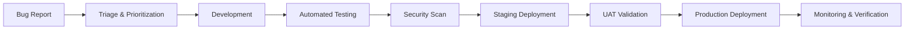

# CloudInsight Architecture Documentation


This document provides a comprehensive overview of the CloudInsight microservices architecture, including both the CI/CD pipeline and the cloud infrastructure design. We've designed our architecture following the AWS Well-Architected Framework principles for high availability, scalability, and security across three environments: Development, Staging, and Production.

## 📋 Table of Contents

- [Overview](#overview)
- [CI/CD Pipeline Architecture](#cicd-pipeline-architecture)
- [Infrastructure Architecture](#infrastructure-architecture)
- [AWS Well-Architected Framework Implementation](#aws-well-architected-framework-implementation)
  - [Security](#security)
  - [Reliability](#reliability)
  - [Performance Efficiency](#performance-efficiency)
  - [Cost Optimization](#cost-optimization)
- [Technology Stack](#technology-stack)
- [Environment Strategy](#environment-strategy)
- [Configuration Management](#configuration-management)
- [Deployment Strategy](#deployment-strategy)
- [Performance Testing](#performance-testing)
- [Maintenance Plan](#maintenance-plan)
- [Project Timeline](#project-timeline)
- [Getting Started](#getting-started)

---

## 📖 Overview

CloudInsight is a cost optimization platform designed for cloud infrastructure management. We've implemented a microservices architecture consisting of Frontend, User, Cost, Metric, Anomaly, Forecast, and Notification services. Our infrastructure leverages AWS services with Kubernetes (EKS) orchestration for scalability and resilience.

#### **Core Architecture Principles**

- **Microservices Design**: Independent, scalable services
- **Event-Driven Communication**: Asynchronous messaging with Kafka
- **GitOps Deployment**: Declarative infrastructure and application management
- **Multi-Environment Strategy**: Isolated dev/staging/production environments
- **Cost-Conscious Design**: Optimized for efficiency and budget constraints

---

## 🚀 CI/CD Pipeline Architecture


Our CI/CD pipeline implements GitOps principles with GitHub Actions for continuous integration and ArgoCD for continuous deployment. The pipeline ensures automated testing, security scanning, and deployment across all environments.

### **Pipeline Architecture Overview**


### **CI Pipeline (GitHub Actions)**

#### **Build & Test Stage**

- **Unit Testing**: Vitest for Next.js frontend, JUnit/Mockito for Spring Boot backend
- **Build Tools**: pnpm for frontend, Maven for Java backend builds
- **Integration Testing**: API endpoint testing with test databases
- **Code Quality**: SonarQube integration for code analysis
#### **Test Coverage**

- **Development**: No minimum coverage requirement during rapid development
- **Staging**: Minimum 80% coverage before deployment
- **Production**: Minimum 80% coverage strictly enforced via quality gates

#### **Security & Compliance**

- **SAST**: CodeQL for static application security testing
- **Dependency Scanning**: Snyk for vulnerability detection
- **Container Scanning**: Trivy for Docker image security assessment
- **License Compliance**: FOSSA for open source license management

#### **Artifact Management**

- **Container Registry**: Amazon ECR for Docker images
- **Versioning Strategy**: Semantic versioning with Git tags
- **Image Optimization**: Multi-stage builds for minimal image sizes

### **CD Pipeline (ArgoCD)**

#### **GitOps Workflow**

1. **Application Repository**: Source code and application manifests
2. **Configuration Repository**: Kubernetes manifests and Helm charts
3. **ArgoCD Sync**: Automated deployment based on Git state
4. **Environment Promotion**: Progressive deployment across environments

#### **Deployment Strategy**

- **Blue-Green Deployment**: Zero-downtime deployments in production
- **Canary Releases**: Gradual traffic shifting for risk mitigation
- **Rollback Capability**: Instant rollback to previous stable versions
- **Health Checks**: Comprehensive readiness and liveness probes

### **Environment-Specific Pipeline Behavior**

### **Environment-Specific Pipeline Behavior**

| **Environment** | **Branch**       | **Trigger**      | **Testing Level**  | **Deployment Strategy** | **Approval Required** |
| --------------- | ---------------- | ---------------- | ------------------ | ----------------------- | --------------------- |
| **Development** | development      | Every commit     | Unit + Integration | Automatic               | No                    |
| **Staging**     | staging          | Merge to staging | Full test suite    | Automatic               | No                    |
| **Production**  | production       | Merge to production | E2E + Performance  | Blue-Green              | Yes                   |

### **Pipeline Monitoring & Observability**

#### **Metrics & Alerting**

- **Build Success Rate**: Target 95%+ success rate
- **Deployment Frequency**: Daily deployments to development
- **Lead Time**: Commit to production in under 4 hours
- **Mean Time to Recovery**: Under 30 minutes for rollbacks

#### **Slack Integration**

- **Build Notifications**: Success/failure alerts
- **Deployment Status**: Real-time deployment progress
- **Security Alerts**: Critical vulnerability notifications
- **Performance Alerts**: Post-deployment performance monitoring

---

## 🏗️ Infrastructure Architecture


Our infrastructure is built on AWS using best practices for scalability, security, and cost optimization. The architecture leverages managed services where possible to reduce operational overhead while maintaining high availability.

### **Infrastructure Overview Diagram**

```
┌─────────────────────────────────────────────────────────────────┐
│                           AWS Cloud                            │
├─────────────────────────────────────────────────────────────────┤
│  ┌─────────────────┐    ┌─────────────────┐    ┌──────────────┐ │
│  │  Public Subnet  │    │ Private Subnet  │    │ Data Subnet  │ │
│  │                 │    │                 │    │              │ │
│  │  ┌───────────┐  │    │  ┌───────────┐  │    │ ┌──────────┐ │ │
│  │  │    ALB    │  │    │  │  EKS Nodes│  │    │ │   RDS    │ │ │
│  │  └───────────┘  │    │  └───────────┘  │    │ └──────────┘ │ │
│  │                 │    │                 │    │              │ │
│  │  ┌───────────┐  │    │  ┌───────────┐  │    │ ┌──────────┐ │ │
│  │  │   WAF     │  │    │  │ Workloads │  │    │ │DocumentDB│ │ │
│  │  └───────────┘  │    │  └───────────┘  │    │ └──────────┘ │ │
│  └─────────────────┘    └─────────────────┘    └──────────────┘ │
└─────────────────────────────────────────────────────────────────┘
```

### **Core Infrastructure Components**

#### **Compute Layer**

- **Amazon EKS**: Managed Kubernetes service for container orchestration
- **EC2 Worker Nodes**: Auto-scaling groups with spot and on-demand instances
- **Node Groups**: Separate groups for different workload types
- **Cluster Autoscaler**: Automatic node scaling based on resource demands

#### **Network Architecture**

- **VPC Configuration**: Multi-AZ setup with public, private, and data subnets
- **Internet Gateway**: Public internet access for load balancers
- **NAT Gateway**: Outbound internet access for private subnets
- **Route53**: DNS management and health checks

#### **Load Balancing & Ingress**

- **Application Load Balancer (ALB)**: Layer 7 load balancing
- **AWS Load Balancer Controller**: Kubernetes native load balancer integration
- **NGINX Ingress**: In-cluster traffic routing and SSL termination
- **SSL/TLS Certificates**: AWS Certificate Manager for HTTPS

#### **Data Layer**

- **Amazon RDS PostgreSQL**: Primary relational database with Multi-AZ
- **Amazon DocumentDB**: MongoDB-compatible document database
- **Amazon MSK**: Managed Apache Kafka for event streaming
- **S3 Buckets**: Object storage for logs, backups, and static assets

### **Security Architecture**

#### **Network Security**

- **AWS WAF**: Web application firewall for threat protection
- **AWS Shield Standard**: DDoS protection for public resources
- **Security Groups**: Firewall rules at instance level
- **NACLs**: Subnet-level network access control

#### **Identity & Access Management**

- **IAM Roles**: Service-specific permissions with least privilege
- **IRSA**: IAM Roles for Service Accounts in EKS
- **AWS Secrets Manager**: Secure credential storage and rotation
- **RBAC**: Kubernetes role-based access control

#### **Data Protection**

- **Encryption at Rest**: EBS, RDS, and S3 encryption
- **Encryption in Transit**: TLS 1.2+ for all communications
- **Key Management**: AWS KMS for encryption key management
- **Backup Strategy**: Automated backups with point-in-time recovery

### **Monitoring & Observability**

#### **Metrics & Monitoring Stack**

- **Prometheus**: Metrics collection and alerting
- **Grafana**: Visualization and dashboarding
- **AWS CloudWatch**: Native AWS service monitoring
- **Node Exporter**: System-level metrics collection

#### **Logging Architecture**

- **FluentBit**: Log forwarding and processing
- **CloudWatch Logs**: Centralized log storage
- **Log Aggregation**: Application and infrastructure logs
- **Log Retention**: 30-day retention for cost optimization

#### **Distributed Tracing**

- **Jaeger**: Request tracing across microservices
- **OpenTelemetry**: Standardized observability framework
- **APM Integration**: Application performance monitoring
- **Service Mesh**: Istio for advanced traffic management (future)

---

## 🏛️ AWS Well-Architected Framework Implementation

Our architecture follows the AWS Well-Architected Framework's six pillars to ensure optimal design across all dimensions.

### 🔒 Security

#### **Security in Depth Strategy**

- **Network Isolation**: VPC with private subnets for workloads
- **Zero Trust Model**: No implicit trust, verify everything
- **Least Privilege Access**: Minimal required permissions
- **Defense in Layers**: Multiple security controls at each layer

#### **Identity & Access Management**

- **IAM Best Practices**: Role-based access with temporary credentials
- **Service Account Integration**: IRSA for Kubernetes workload permissions
- **MFA Enforcement**: Multi-factor authentication for human access
- **Regular Access Reviews**: Quarterly permission audits

#### **Data Protection**

- **Encryption Everywhere**: At rest, in transit, and in use
- **Secret Management**: AWS Secrets Manager with automatic rotation
- **Database Security**: VPC isolation, encryption, and backup encryption
- **Container Security**: Image scanning and runtime protection

#### **Infrastructure Protection**

- **WAF Rules**: OWASP Top 10 protection
- **DDoS Mitigation**: AWS Shield Standard
- **Network Segmentation**: Security groups and NACLs
- **Patch Management**: Automated OS and container updates

### 🔧 Reliability

#### **High Availability Design**

- **Multi-AZ Deployment**: Services distributed across availability zones
- **Auto-Scaling**: Horizontal and vertical scaling capabilities
- **Health Checks**: Comprehensive application and infrastructure monitoring
- **Circuit Breakers**: Fault tolerance patterns in microservices

#### **Disaster Recovery**

- **RTO Target**: 4 hours for full system recovery
- **RPO Target**: 1 hour maximum data loss
- **Backup Strategy**: Automated daily backups with 30-day retention
- **Cross-Region Replication**: Critical data backup to secondary region

#### **Fault Tolerance**

- **Graceful Degradation**: Services continue with reduced functionality
- **Bulkhead Pattern**: Isolated failure domains
- **Retry Logic**: Exponential backoff with jitter
- **Dead Letter Queues**: Failed message handling

#### **Change Management**

- **Blue-Green Deployments**: Zero-downtime updates
- **Canary Releases**: Gradual rollout with automatic rollback
- **Infrastructure as Code**: Reproducible environments
- **Testing Strategy**: Comprehensive testing including chaos engineering

### ⚡ Performance Efficiency

#### **Compute Optimization**

- **Right-Sizing**: Continuous monitoring and adjustment of resources
- **Auto-Scaling Policies**: CPU, memory, and custom metrics-based scaling
- **Spot Instances**: Cost-effective compute for non-critical workloads
- **ARM-Based Instances**: Graviton2 instances for better price-performance

#### **Storage Performance**

- **SSD Storage**: GP3 volumes for optimal IOPS and throughput
- **Database Optimization**: Read replicas and connection pooling
- **Caching Strategy**: Redis for application-level caching
- **CDN Integration**: CloudFront for static asset delivery

#### **Network Performance**

- **Enhanced Networking**: SR-IOV for improved network performance
- **Placement Groups**: Cluster placement for low-latency communication
- **Load Balancer Optimization**: Connection draining and health checks
- **Regional Optimization**: Resources in primary user geographic region

#### **Monitoring & Analysis**

- **Performance Baselines**: Established metrics for all services
- **Continuous Profiling**: Application performance analysis
- **Resource Utilization Tracking**: CPU, memory, disk, and network monitoring
- **Performance Testing**: Regular load testing and bottleneck identification

### 💰 Cost Optimization

#### **Strategic Cost Management**

We've implemented aggressive cost optimization strategies to maintain our $80 monthly budget during the 10-week development phase while ensuring adequate performance for demonstration and testing.

#### **Optimized Infrastructure Costs (Monthly)**

| **Environment**   | **Configuration**             | **Monthly Cost (USD)** | **Cost Optimization Strategy**                  |
| ----------------- | ----------------------------- | ---------------------- | ----------------------------------------------- |
| **Development**   | 1 node (t3.medium, spot)      | $15                    | Spot instances, auto-shutdown evenings/weekends |
| **Staging**       | 1 node (t3.large, on-demand)  | $35                    | Minimal resources, scheduled scaling            |
| **Production**    | 2 nodes (t3.large, on-demand) | $30                    | Right-sized for demo requirements               |
| **Total Compute** |                               | **$80**                | **Within budget target**                        |

#### **Extreme Cost Optimization Strategies**

##### **Compute Optimization**

- **Spot Instances (Dev)**: 70% cost savings using t3.medium spot instances
- **Cluster Autoscaler**: Scales nodes down to 0 during off-hours
- **HPA (Horizontal Pod Autoscaler)**: Scales pods down to 1 replica minimum
- **Scheduled Scaling**: Dev environment shuts down 8 PM - 8 AM and weekends

##### **Database Cost Reduction**

- **Single RDS Instance**: db.t3.micro for development ($15/month)
- **Shared DocumentDB**: t3.medium cluster shared across environments ($25/month)
- **Local Development**: Developers use local databases for initial development

##### **Infrastructure Sharing**

- **Single EKS Cluster**: All environments share one cluster using namespaces
- **Shared Load Balancer**: Single ALB with namespace-based routing
- **Single NAT Gateway**: Shared across all environments

#### **Auto-Scaling Configuration**

- **Scale-to-Zero**: Development pods scale to 0 replicas during off-hours
- **Minimum Viable Scaling**: 1 pod minimum, 3 pod maximum per service
- **Resource Requests**: Minimal CPU/memory requests to maximize pod density
- **QoS Classes**: BestEffort for development, Guaranteed for production

#### **Cost Monitoring & Alerts**

- **Daily Cost Tracking**: Automated cost monitoring with Slack alerts
- **Budget Alerts**: 80% and 100% budget threshold notifications
- **Resource Optimization**: Weekly reviews for unused resources
- **Tagging Strategy**: Comprehensive resource tagging for cost allocation

---

## 🛠️ Technology Stack

### **Container Orchestration**

- **Kubernetes (EKS)**: v1.28+ for container orchestration
- **Docker**: Container runtime and image building
- **Helm**: Package management for Kubernetes applications
- **Kustomize**: Configuration management and customization

### **CI/CD & GitOps**

- **GitHub Actions**: Continuous integration and automated testing
- **ArgoCD**: GitOps continuous deployment
- **Terraform**: Infrastructure as Code
- **GitHub**: Version control and collaboration

### **Monitoring & Observability**

- **Prometheus**: Metrics collection and alerting
- **Grafana**: Visualization and dashboarding
- **Jaeger**: Distributed tracing
- **FluentBit**: Log collection and forwarding

### **Data & Messaging**

- **PostgreSQL (RDS)**: Primary relational database
- **MongoDB (DocumentDB)**: Document database for flexible data
- **Apache Kafka (MSK)**: Event streaming and messaging
- **Redis**: Caching and session storage

### **Security & Networking**

- **AWS WAF**: Web application firewall
- **AWS Certificate Manager**: SSL/TLS certificate management
- **AWS Secrets Manager**: Secure credential storage
- **NGINX Ingress**: Load balancing and SSL termination

---

## 🌍 Environment Strategy

### **Three-Tier Environment Model**

| **Environment** | **Purpose**                    | **Infrastructure**             | **Access Control**   |
| --------------- | ------------------------------ | ------------------------------ | -------------------- |
| **Development** | Feature development & testing  | 1 node, auto-scaling           | All developers       |
| **Staging**     | Integration testing & QA       | 1 node, production-like config | QA team + Tech leads |
| **Production**  | Live system for demonstrations | 2 nodes, high availability     | DevOps team only     |

### **Environment Isolation**

- **Namespace Separation**: Kubernetes namespaces for workload isolation
- **Network Policies**: Isolated network traffic between environments
- **Resource Quotas**: Dedicated CPU/memory limits per environment
- **RBAC Policies**: Environment-specific access controls

### **Data Management**

- **Development**: Synthetic data for testing
- **Staging**: Anonymized production data subset
- **Production**: Real data with full backup and encryption

---

## ⚙️ Configuration Management

### **Configuration Strategy**

- **ConfigMaps**: Non-sensitive application configuration
- **Secrets**: Sensitive data with encryption at rest
- **Environment Variables**: Runtime configuration injection
- **Helm Values**: Environment-specific deployment configuration

### **Secret Management**

- **AWS Secrets Manager**: External secret storage with rotation
- **External Secrets Operator**: Kubernetes secret synchronization
- **Least Privilege Access**: Minimal secret access permissions
- **Regular Rotation**: Automated credential rotation schedules

### **Environment-Specific Configuration**

#### **Development Environment**

- **Debug Logging**: Verbose logging for troubleshooting
- **Fast Feedback**: Minimal resource constraints for rapid testing
- **Mock Services**: External service mocking for isolated testing
- **Hot Reloading**: Live code updates without full deployments

#### **Staging Environment**

- **Production Parity**: Configuration matching production settings
- **Integration Testing**: Real service dependencies
- **Performance Testing**: Load testing and benchmarking
- **Security Testing**: Vulnerability scanning and penetration testing

#### **Production Environment**

- **Optimized Performance**: Production-tuned configuration
- **Enhanced Security**: Strict security policies and monitoring
- **Comprehensive Monitoring**: Full observability stack
- **Disaster Recovery**: Backup and recovery procedures

---

## 🚢 Deployment Strategy

### **GitOps Workflow**

1. **Code Commit**: Developer pushes code to feature branch
2. **CI Pipeline**: Automated testing, building, and security scanning
3. **PR Review**: Code review and approval process
4. **Merge**: Code merged to develop/main branch
5. **CD Pipeline**: ArgoCD detects changes and deploys automatically
6. **Validation**: Health checks and smoke tests post-deployment

### **Deployment Patterns**

#### **Development Environment**

- **Direct Deployment**: Immediate deployment on every commit
- **Rolling Updates**: Simple rolling deployment strategy
- **Fast Rollback**: Quick revert to previous version if needed

#### **Staging Environment**

- **Feature Branches**: Deploy feature branches for testing
- **Integration Testing**: Full test suite execution
- **User Acceptance Testing**: Manual testing by QA team

#### **Production Environment**

- **Blue-Green Deployment**: Zero-downtime production deployments
- **Canary Releases**: Gradual traffic shifting to new versions
- **Manual Approval**: Required approval gate for production deployments
- **Automated Rollback**: Automatic rollback on health check failures

### **Health Checks & Monitoring**

- **Readiness Probes**: Service availability checks
- **Liveness Probes**: Service health monitoring
- **Startup Probes**: Initial service startup validation
- **Custom Health Endpoints**: Application-specific health indicators

---

## 🧪 Performance Testing

### **Testing Strategy**

- **Load Testing**: JMeter for API endpoint performance testing
- **Stress Testing**: System behavior under extreme load conditions
- **Spike Testing**: Sudden traffic increase handling
- **Volume Testing**: Large data set processing capabilities

### **Performance Metrics**

- **Response Time**: API response time under 200ms (p95)
- **Throughput**: Minimum 1000 requests per second
- **Resource Utilization**: CPU usage under 70%, memory under 80%
- **Error Rate**: Less than 0.1% error rate under normal load

### **Continuous Performance Monitoring**

- **Baseline Establishment**: Performance benchmarks for each release
- **Regression Detection**: Automated performance comparison
- **Performance Budgets**: Predefined performance thresholds
- **Real User Monitoring (RUM)**: Production performance tracking

---

## 🔧 Maintenance Plan

### **Regular Maintenance Tasks**

#### **Weekly Maintenance**

- **Security Updates**: Apply critical security patches
- **Cost Review**: Analyze and optimize resource usage
- **Performance Review**: Check performance metrics and alerts
- **Backup Verification**: Validate backup integrity and recovery procedures

#### **Monthly Maintenance**

- **Capacity Planning**: Review and adjust resource allocations
- **Security Audit**: Comprehensive security review and vulnerability assessment
- **Dependency Updates**: Update container images and application dependencies
- **Documentation Updates**: Keep architecture and runbook documentation current

#### **Quarterly Maintenance**

- **Disaster Recovery Testing**: Full DR procedure validation
- **Access Review**: Review and update user access permissions
- **Architecture Review**: Evaluate and optimize architectural decisions
- **Cost Optimization**: Comprehensive cost analysis and optimization

### **Incident Response**

- **On-Call Rotation**: 24/7 incident response team
- **Escalation Procedures**: Clear escalation path for critical issues
- **Post-Incident Reviews**: Learning and improvement process
- **Runbook Maintenance**: Keep troubleshooting guides updated

---

## 📅 Project Timeline

### **10-Week Development Schedule**

| **Week** | **Focus Area**            | **Deliverables**                          | **Environment** |
| -------- | ------------------------- | ----------------------------------------- | --------------- |
| **1-2**  | Infrastructure Setup      | EKS cluster, CI/CD pipeline, monitoring   | Development     |
| **3-4**  | Core Services Development | User, Cost, Metric services               | Development     |
| **5-6**  | Advanced Features         | Anomaly, Forecast, Notification services  | Development     |
| **7**    | Integration & Testing     | End-to-end testing, performance testing   | Staging         |
| **8**    | Security & Compliance     | Security hardening, compliance validation | Staging         |
| **9**    | Production Preparation    | Production deployment, monitoring setup   | Production      |
| **10**   | Final Testing & Demo Prep | User acceptance testing, demo preparation | Production      |

### **Key Milestones**

- **Week 2**: Development environment fully operational
- **Week 4**: All microservices deployed and communicating
- **Week 6**: Feature complete with monitoring and alerting
- **Week 8**: Security audit passed, staging environment validated
- **Week 10**: Production-ready system for demonstration

---

## 🚀 Getting Started

### **Prerequisites**

- AWS Account with appropriate permissions
- Terraform v1.5+
- kubectl v1.28+
- Helm v3.12+
- Docker v24.0+

### **Quick Setup**

1. **Clone Repository**: `git clone <repository-url>`
2. **Setup AWS Credentials**: Configure AWS CLI with necessary permissions
3. **Deploy Infrastructure**: `cd terraform && terraform apply`
4. **Configure kubectl**: Update kubeconfig for EKS cluster access
5. **Deploy Applications**: ArgoCD will automatically sync applications

### **Development Environment Access**

- **Grafana Dashboard**: `https://grafana.dev.cloudinsight.com`
- **ArgoCD UI**: `https://argocd.dev.cloudinsight.com`
- **API Gateway**: `https://api.dev.cloudinsight.com`

### **Documentation Links**

- [Development Setup Guide](../dev-repo-setup/README.md)
- [CI/CD Pipeline Documentation](./cicd-architecture.png)
- [Infrastructure Diagrams](./infra-architecture.png)
- [Security Guidelines](../security/README.md)

---

**📞 Support & Contact**
For questions or issues, please contact the DevOps team or create an issue in the repository.

**🏷️ Version**: 1.0  
**📅 Last Updated**: December 2024  
**👥 Maintained By**: CloudInsight DevOps Team

##### **Cluster Autoscaler Settings**

- **Scale Down Delay**: 2 minutes (aggressive cost saving)
- **Scale Down Utilization**: 30% (scale down when nodes underutilized)
- **Max Nodes**: 3 nodes per environment
- **Min Nodes**: 0 nodes (complete shutdown possible)

##### **HPA Configuration**

- **CPU Target**: 50% (lower threshold for aggressive scaling)
- **Memory Target**: 60%
- **Min Replicas**: 1 pod per service
- **Max Replicas**: 5 pods per service
- **Scale Down Period**: 3 minutes

#### **Development Phase Resource Planning**

| **Week** | **Expected Load**    | **Resource Allocation** | **Estimated Cost** |
| -------- | -------------------- | ----------------------- | ------------------ |
| **1-3**  | Low (development)    | 1 node per env          | $60                |
| **4-6**  | Medium (integration) | 2 nodes max             | $75                |
| **7-8**  | High (testing)       | 3 nodes max             | $80                |
| **9-10** | Demo preparation     | Optimized for demos     | $80                |

#### **Cost Monitoring & Alerts**

We've implemented strict cost controls:

- **Daily Budget Alerts**: Alert at $3/day spending
- **Weekly Budget Reviews**: Team review every Friday
- **Automatic Shutdowns**: Dev environment auto-shutdown after business hours
- **Resource Tagging**: Track costs per service and environment

---

## 📅 CloudInsight DevOps Milestones & Timeline (10 Weeks)

### **Development Timeline - 1 Program Increment (PI)**

| **Week** | **Milestone**                         | **DevOps Focus**                  | **Infrastructure Priority**      |
| -------- | ------------------------------------- | --------------------------------- | -------------------------------- |
| **1**    | Microservice scaffolding + SSO auth   | EKS cluster setup, CI/CD pipeline | Basic infrastructure deployment  |
| **2-3**  | Forecast and anomaly services built   | Service mesh setup, monitoring    | Auto-scaling configuration       |
| **3-4**  | Tag audit and CUR processing pipeline | Data pipeline infrastructure      | Storage and compute optimization |
| **4-5**  | Dashboard APIs and UI integration     | Load balancer configuration       | Frontend infrastructure          |
| **5-6**  | Kafka stream handling + alert service | Message queue setup, alerting     | Event-driven architecture        |
| **6-7**  | Performance tuning + observability    | Monitoring stack deployment       | Performance optimization         |
| **8**    | End-to-end testing and QA             | Test environment stabilization    | Full system validation           |
| **9**    | Documentation and onboarding setup    | Documentation deployment          | Knowledge transfer setup         |
| **10**   | Final demo and rollout                | Production readiness              | Demo environment preparation     |

#### **DevOps Deliverables by Week**

##### **Weeks 1-2: Foundation**

- EKS cluster provisioning with Terraform
- CI/CD pipeline setup with GitHub Actions
- ArgoCD deployment and configuration
- Basic monitoring with Prometheus/Grafana

##### **Weeks 3-4: Core Infrastructure**

- Auto-scaling policies implementation
- Security controls (WAF, secrets management)
- Database setup (RDS PostgreSQL, DocumentDB)
- Network configuration optimization

##### **Weeks 5-6: Advanced Features**

- Kafka/MSK integration
- Alert management system
- Performance monitoring dashboard
- Load testing framework

##### **Weeks 7-8: Testing & Validation**

- End-to-end testing automation
- Performance benchmarking
- Security testing and compliance
- Disaster recovery testing

##### **Weeks 9-10: Documentation & Demo**

- Infrastructure documentation completion
- Runbook creation
- Demo environment preparation
- Knowledge transfer sessions

#### **Resource Scaling Timeline**

| **Phase**             | **Nodes** | **Pods**   | **Cost/Week** |
| --------------------- | --------- | ---------- | ------------- |
| **Dev Phase (1-4)**   | 1-2 nodes | 5-10 pods  | $15-20        |
| **Integration (5-6)** | 2-3 nodes | 10-15 pods | $18-25        |
| **Testing (7-8)**     | 2-4 nodes | 15-20 pods | $20-25        |
| **Demo Prep (9-10)**  | 3-4 nodes | 20+ pods   | $20-25        |

---

## 🚀 Getting Started Production performance tracking

---

This document provides a comprehensive overview of our CloudInsight microservices architecture, including both the CI/CD pipeline and cloud infrastructure design. We've designed the architecture for high availability, scalability, and security across three environments: Development, Staging, and Production.

## 📋 Table of Contents

## 🔧 Maintenance Plan

### **CloudInsight Post-Deployment Maintenance Strategy**

Given our deployment in Rwanda and the critical nature of our CloudInsight cost optimization platform, we have developed a comprehensive maintenance plan that accounts for our unique geographical and infrastructure requirements.

#### **Regional Considerations for CloudInsight Rwanda**

Based on our location in Rwanda, we decided to deploy our CloudInsight infrastructure in the **AWS Africa (Cape Town) ap-south-1 region** as our primary region, with **EU (Ireland) eu-west-1** as our disaster recovery region. This configuration provides:ree environments: Development, Staging, and Production.

## 📋 Table of Contents

- [CI/CD Pipeline Architecture](#cicd-pipeline-architecture)
- [Infrastructure Architecture](#infrastructure-architecture)
- [Technology Stack](#technology-stack)
- [Environment Strategy](#environment-strategy)
- [Security Considerations](#security-considerations)
- [Monitoring and Observability](#monitoring-and-observability)
- [Configuration Management](#️-configuration-management)
- [Logging and Monitoring](#-logging-and-monitoring)
- [Deployment Strategy](#-deployment-strategy)
- [Performance Testing](#-performance-testing)
- [AWS Cost Estimation](#-aws-cost-estimation)
- [Maintenance Plan](#-maintenance-plan)

---

## 🚀 CI/CD Pipeline Architecture


_[View Full CI/CD Architecture](./cicd-architecture.png)_

We've implemented a modern GitOps-based CI/CD pipeline for the CloudInsight project with clear separation of concerns between Continuous Integration (CI) and Continuous Deployment (CD).

### CI Pipeline (GitHub Actions)

We've configured our Continuous Integration pipeline to trigger on **Pull Requests** and require all checks to pass before merging:

#### 🔍 **Quality Gates**

1. **Code Review**: We require approval from CODEOWNERS
2. **Unit Tests**: We execute comprehensive unit test suites
3. **Integration Tests**: We validate service interactions
4. **Code Quality**: We use SonarQube analysis for code quality metrics
5. **Security Scanning**: We implement Trivy vulnerability scanning
6. **Build & Push**: We build Docker images and push to AWS ECR

#### 📊 **CI Pipeline Flow**

**Pull Request → CODEOWNERS Review → Unit Tests → Integration Tests → SonarQube Analysis → Trivy Security Scan → Docker Build → Push to ECR → Update GitOps Repo**

### CD Pipeline (ArgoCD)

We manage Continuous Deployment using **ArgoCD** following GitOps principles:

#### 🎯 **GitOps Workflow**

1. **Image Version Update**: Our CI pipeline updates image tags in the GitOps repository
2. **ArgoCD Detection**: ArgoCD monitors our GitOps repo for changes
3. **Automatic Sync**: ArgoCD syncs changes to the target environment
4. **Health Monitoring**: We maintain continuous health checks on deployed services
5. **Slack Notifications**: We receive deployment status updates in our Slack channels

#### 🏗️ **ArgoCD Features**

- **Multi-Environment Management**: We maintain separate ArgoCD applications for dev/staging/prod
- **Rollback Capabilities**: We have one-click rollback to previous versions
- **Drift Detection**: We identify configuration drift from Git source
- **Progressive Deployment**: We support blue-green and canary deployments

---

## 🏗️ Infrastructure Architecture


_[View Full Infrastructure Architecture](./infra-architecture.png)_

We've built our CloudInsight infrastructure on AWS using a multi-tier, multi-AZ architecture for high availability and fault tolerance.

### 🌐 Network Architecture

#### **VPC Design**

- **CIDR Block**: `10.0.0.0/16`
- **Multi-AZ Deployment**: 2 Availability Zones for redundancy
- **Subnet Strategy**:
  - **Public Subnets**: `10.0.1.0/24`, `10.0.2.0/24` (NLB, NAT Gateway)
  - **Private Subnets**: `10.0.11.0/24`, `10.0.12.0/24` (EKS Nodes)

#### **Traffic Flow**

```
Internet → Route53 → WAF → NLB → NGINX Ingress → Services
```

### 🔒 Security Layer

#### **AWS Security Services**

- **AWS WAF**: Web Application Firewall with DDoS protection
- **AWS Shield**: Advanced DDoS protection
- **Route 53**: DNS management with health checks
- **AWS Secrets Manager**: Secure secret storage and rotation

#### **Certificate Management**

- **Cert-Manager**: Automated TLS certificate provisioning
- **Let's Encrypt**: Free SSL/TLS certificates
- **NGINX Ingress**: TLS termination and routing

### ☸️ Kubernetes Layer (EKS)

#### **Cluster Configuration**

- **EKS Version**: Latest stable version
- **Node Groups**: Multi-AZ deployment across private subnets
- **Pod Security**: Pod Security Standards enforcement
- **Network Policy**: Kubernetes Network Policies for micro-segmentation

#### **Core Services**

##### **Application Services**

| Service                  | Purpose                          | Database       | Messaging |
| ------------------------ | -------------------------------- | -------------- | --------- |
| **Frontend**             | User Interface                   | -              | -         |
| **User Service**         | Authentication & User Management | PostgreSQL RDS | -         |
| **Cost Service**         | Cost Analysis & Optimization     | DocumentDB     | Kafka     |
| **Metric Service**       | Performance Metrics Collection   | DocumentDB     | Kafka     |
| **Anomaly Service**      | Anomaly Detection & Alerting     | DocumentDB     | Kafka     |
| **Forecast Service**     | Predictive Analytics             | DocumentDB     | Kafka     |
| **Notification Service** | Multi-channel Notifications      | DocumentDB     | Kafka     |

##### **Platform Services**

| Service              | Purpose                          | Technology                |
| -------------------- | -------------------------------- | ------------------------- |
| **API Gateway**      | Request Routing & Rate Limiting  | Kong/Ambassador           |
| **Config Service**   | Centralized Configuration        | Spring Cloud Config       |
| **NGINX Ingress**    | Load Balancing & TLS Termination | NGINX                     |
| **ArgoCD**           | GitOps Continuous Deployment     | ArgoCD                    |
| **External Secrets** | Secret Synchronization           | External Secrets Operator |

### 🗄️ Data Tier

#### **Database Strategy**

- **PostgreSQL RDS**: Multi-AZ deployment for User Service
  - Automated backups and point-in-time recovery
  - Read replicas for performance optimization
- **Amazon DocumentDB**: MongoDB-compatible for microservices
  - Multi-AZ cluster deployment
  - Automated backup and restore
  - Support for Cost, Metric, Anomaly, and Forecast services

#### **Message Streaming**

- **Amazon MSK (Kafka)**: Multi-AZ Kafka cluster
  - 3 brokers across availability zones
  - Automatic scaling and monitoring
  - Used for asynchronous inter-service communication

### 🔧 Infrastructure Services

#### **Container Management**

- **Amazon ECR**: Private container registry
  - Vulnerability scanning enabled
  - Lifecycle policies for image management
  - Cross-region replication

#### **Networking**

- **Network Load Balancer**: High-performance L4 load balancing
- **Single NAT Gateway**: Cost-optimized outbound internet access
- **Internet Gateway**: Inbound internet connectivity

#### **Storage**

- **Amazon S3**: Object storage for backups and artifacts
  - Versioning and lifecycle policies
  - Cross-region replication for disaster recovery

---

## 🛠️ Technology Stack

### **Infrastructure**

| Component                   | Technology | Purpose                       |
| --------------------------- | ---------- | ----------------------------- |
| **Cloud Provider**          | AWS        | Primary cloud platform        |
| **Container Orchestration** | Amazon EKS | Kubernetes cluster management |
| **Container Registry**      | Amazon ECR | Docker image storage          |
| **Load Balancer**           | AWS NLB    | Traffic distribution          |
| **Ingress Controller**      | NGINX      | Application routing           |

### **Data & Messaging**

| Component               | Technology        | Purpose                    |
| ----------------------- | ----------------- | -------------------------- |
| **Relational Database** | PostgreSQL RDS    | User data storage          |
| **Document Database**   | Amazon DocumentDB | Microservices data         |
| **Message Streaming**   | Amazon MSK        | Event-driven communication |
| **Caching**             | Redis ElastiCache | Performance optimization   |

### **DevOps & Monitoring**

| Component             | Technology              | Purpose                  |
| --------------------- | ----------------------- | ------------------------ |
| **CI/CD**             | GitHub Actions + ArgoCD | Automated deployment     |
| **GitOps**            | ArgoCD                  | Declarative deployments  |
| **Monitoring**        | Prometheus + Grafana    | Metrics and dashboards   |
| **Logging**           | AWS CloudWatch          | Centralized logging      |
| **Security Scanning** | Trivy                   | Vulnerability assessment |

---

## 🌍 Environment Strategy

### **Environment Isolation**

Each environment (Development, Staging, Production) maintains complete resource isolation:

#### **Shared Resources**

- Route 53 Hosted Zone (with environment subdomains)
- ECR Container Registry
- S3 Buckets (with environment prefixes)

#### **Environment-Specific Resources**

- Dedicated EKS clusters
- Separate RDS and DocumentDB instances
- Independent MSK clusters
- Isolated VPCs with separate subnets
- Environment-specific security groups

### **Environment Configuration**

| Environment     | Domain                     | Purpose                         | Scaling                   |
| --------------- | -------------------------- | ------------------------------- | ------------------------- |
| **Development** | `dev.cloudinsight.com`     | Feature development and testing | Minimal resources         |
| **Staging**     | `staging.cloudinsight.com` | Pre-production validation       | Production-like resources |
| **Production**  | `prod.cloudinsight.com`    | Live customer traffic           | Full scaling capabilities |

---

## 🔐 Security Considerations

### **Network Security**

- **Private Subnets**: All application components in private subnets
- **Security Groups**: Least-privilege access rules
- **NACLs**: Additional network-level security
- **VPC Flow Logs**: Network traffic monitoring

### **Application Security**

- **Pod Security Standards**: Kubernetes security policies
- **Service Mesh**: Istio for service-to-service encryption
- **RBAC**: Role-based access control
- **Secret Management**: AWS Secrets Manager integration

### **Data Security**

- **Encryption at Rest**: All databases encrypted
- **Encryption in Transit**: TLS for all communications
- **Backup Encryption**: Encrypted backups and snapshots
- **Key Management**: AWS KMS for key rotation

---

## 📊 Monitoring and Observability

### **Metrics Collection**

- **Prometheus**: Kubernetes and application metrics
- **Grafana**: Visualization and dashboards
- **AWS CloudWatch**: Infrastructure metrics and logs

### **Alerting Strategy**

- **Prometheus AlertManager**: Rule-based alerting
- **Slack Integration**: Real-time notifications
- **PagerDuty**: Critical incident escalation

### **Logging Architecture**

- **Centralized Logging**: AWS CloudWatch Logs
- **Log Aggregation**: Fluent Bit for log forwarding
- **Log Analysis**: CloudWatch Insights for querying

### **Health Monitoring**

- **Kubernetes Probes**: Liveness and readiness checks
- **Service Monitors**: Prometheus service discovery
- **Infrastructure Health**: AWS Health Dashboard integration

---

## ⚙️ Configuration Management

### **Configuration Strategy**

Configuration management is handled through a multi-layered approach ensuring environment-specific settings while maintaining consistency across deployments.

#### **Configuration Sources**

| Source                    | Purpose                   | Technology                             | Scope                          |
| ------------------------- | ------------------------- | -------------------------------------- | ------------------------------ |
| **ConfigMaps**            | Application configuration | Kubernetes ConfigMaps                  | Non-sensitive config           |
| **Secrets**               | Sensitive data            | AWS Secrets Manager + External Secrets | API keys, DB credentials       |
| **Environment Variables** | Runtime configuration     | Kubernetes Deployment specs            | Service-specific settings      |
| **Helm Values**           | Deployment parameters     | Helm Charts                            | Environment-specific overrides |

#### **Environment-Specific Configurations**

##### **Development Environment**

- **Resources**: Minimal CPU and memory allocation for cost efficiency
- **Replicas**: Single instance per service for development testing
- **Database**: Dedicated development RDS instance with relaxed settings
- **Logging**: Debug level for detailed troubleshooting information

##### **Staging Environment**

- **Resources**: Medium CPU and memory allocation for realistic testing
- **Replicas**: Two instances per service for basic redundancy testing
- **Database**: Production-like staging RDS instance with similar configurations
- **Logging**: Info level for important events and business logic tracking

##### **Production Environment**

- **Resources**: High CPU and memory allocation for optimal performance
- **Replicas**: Three or more instances per service for high availability
- **Database**: Production RDS instance with multi-AZ deployment and backups
- **Logging**: Warning level for critical events and error tracking only

#### **Configuration Management Tools**

- **External Secrets Operator**: Syncs secrets from AWS Secrets Manager
- **Config Service**: Centralized configuration management for microservices
- **Helm**: Template-based deployment with environment-specific values
- **ArgoCD**: GitOps-based configuration deployment and drift detection

---

## 📋 Logging and Monitoring

### **Logging Strategy**

#### **Log Levels and Standards**

| Level     | Purpose                         | Usage                                         |
| --------- | ------------------------------- | --------------------------------------------- |
| **ERROR** | System errors and exceptions    | Critical issues requiring immediate attention |
| **WARN**  | Warning conditions              | Potential issues that don't stop execution    |
| **INFO**  | General information             | Important business logic events               |
| **DEBUG** | Detailed diagnostic information | Development and troubleshooting               |

#### **Log Formats**

CloudInsight uses structured JSON logging format with the following key fields:

- **Timestamp**: ISO 8601 format for precise timing
- **Level**: Log severity (ERROR, WARN, INFO, DEBUG)
- **Service**: Name of the microservice generating the log
- **Trace ID**: Unique identifier for request tracing across services
- **Message**: Human-readable description of the event
- **Metadata**: Additional context like user ID, action, and IP address

#### **Log Storage and Retention**

| Environment     | Storage              | Retention                   | Purpose                   |
| --------------- | -------------------- | --------------------------- | ------------------------- |
| **Development** | CloudWatch Logs      | 7 days                      | Debugging and development |
| **Staging**     | CloudWatch Logs      | 30 days                     | Testing and validation    |
| **Production**  | CloudWatch Logs + S3 | 90 days (CW) / 7 years (S3) | Compliance and analysis   |

#### **Log Aggregation Pipeline**

**Microservices → Fluent Bit → CloudWatch Logs → CloudWatch Insights → S3 Archive**

- Dashboards and alerts are generated from CloudWatch Insights
- Long-term storage maintained in S3 for compliance

### **Production Monitoring Strategy**

#### **Key Performance Indicators (KPIs)**

| Category           | Metric             | Target    | Alert Threshold |
| ------------------ | ------------------ | --------- | --------------- |
| **Availability**   | Service Uptime     | 99.9%     | < 99.5%         |
| **Performance**    | Response Time      | < 200ms   | > 500ms         |
| **Throughput**     | Requests/second    | 1000+ RPS | < 500 RPS       |
| **Error Rate**     | 4xx/5xx Errors     | < 1%      | > 2%            |
| **Resource Usage** | CPU Utilization    | < 70%     | > 85%           |
| **Resource Usage** | Memory Utilization | < 80%     | > 90%           |

#### **Monitoring Stack Components**

- **Prometheus**: Metrics collection and storage
- **Grafana**: Visualization and dashboards
- **AlertManager**: Alert routing and notifications
- **CloudWatch**: AWS infrastructure monitoring
- **AWS X-Ray**: Distributed tracing

#### **Alert Escalation Matrix**

| Severity     | Response Time | Notification Channels   | Escalation        |
| ------------ | ------------- | ----------------------- | ----------------- |
| **Critical** | Immediate     | Slack + PagerDuty + SMS | On-call engineer  |
| **High**     | 15 minutes    | Slack + Email           | Team lead         |
| **Medium**   | 1 hour        | Slack                   | Team notification |
| **Low**      | 4 hours       | Email                   | Daily report      |

---

## 🚀 Deployment Strategy

### **Deployment Process Overview**

#### **Build Pipeline (CI)**

**Git Push → GitHub Actions → Unit Tests → Integration Tests → SonarQube Scan → Trivy Security Scan → Docker Build → ECR Push → Update GitOps Repo**

#### **Deployment Pipeline (CD)**

**GitOps Repo Update → ArgoCD Detection → Health Check → Rolling Deployment → Post-deployment Tests → Slack Notification → Production Traffic**

### **CI/CD Pipeline Configuration**

#### **GitHub Actions Workflow**

The CI pipeline is configured to trigger on pull requests to the main branch and includes:

- Code checkout and environment setup
- Unit and integration test execution
- SonarQube code quality analysis
- Trivy security vulnerability scanning
- Docker image building and ECR push
- GitOps repository update with new image tags

#### **ArgoCD Application Configuration**

ArgoCD applications are configured for each CloudInsight service with:

- GitOps repository monitoring for manifest changes
- Automated synchronization with self-healing enabled
- Environment-specific deployment paths (dev/staging/production)
- Health checks and rollback capabilities
- Slack notifications for deployment status updates

### **Rollback Procedures**

#### **Automated Rollback Triggers**

- Health check failures after deployment
- Error rate exceeding 5% for 5 minutes
- Response time degradation > 200% baseline
- Critical alert triggered post-deployment

#### **Manual Rollback Process**

1. **Identify Issue**: Monitor dashboards and alerts
2. **ArgoCD Rollback**: Use ArgoCD UI or CLI to revert to previous version
3. **Database Rollback**: If required, execute database migration rollback
4. **Verification**: Confirm system stability and performance
5. **Incident Documentation**: Record rollback details and root cause

---

## 🔬 Performance Testing

### **Performance Testing Strategy**

**Testing Approach**: Load Testing → Performance Testing → Stress Testing → Volume Testing → Endurance Testing

#### **Key Performance Indicators (KPIs)**

| **Metric**                    | **Target** | **Acceptable** | **Critical** | **What This Means**                                      |
| ----------------------------- | ---------- | -------------- | ------------ | -------------------------------------------------------- |
| **API Response Time (P95)**   | < 200ms    | < 300ms        | > 500ms      | 95% of CloudInsight API calls respond within target time |
| **Page Load Time (P95)**      | < 1.5s     | < 2s           | > 3s         | 95% of dashboard pages load within target time           |
| **Database Query Time (P99)** | < 100ms    | < 200ms        | > 500ms      | 99% of cost data queries complete within target time     |
| **Request Rate (RPS)**        | 1000 RPS   | 1500 RPS       | 2000+ RPS    | Number of user requests CloudInsight handles per second  |
| **Concurrent Users**          | 500 users  | 750 users      | 1000+ users  | Simultaneous users accessing CloudInsight dashboards     |
| **Error Rate**                | < 0.1%     | < 0.5%         | > 1%         | Percentage of failed requests or system errors           |
| **CPU Utilization**           | < 60%      | < 80%          | > 90%        | Average processor usage across all servers               |
| **Memory Utilization**        | < 70%      | < 85%          | > 95%        | Average memory usage across all servers                  |

#### **Understanding Performance Metrics**

##### **Response Time Categories Explained**

- **Target**: Optimal performance providing excellent user experience - users feel the system is fast and responsive
- **Acceptable**: Good performance with slight delays - users notice minor slowness but system remains fully usable
- **Critical**: Poor performance requiring immediate attention - users experience frustrating delays, system may auto-scale or alert administrators

##### **RPS (Requests Per Second) Breakdown**

- **1000 RPS Target**: Normal CloudInsight operations - users browsing dashboards, viewing cost reports, running basic analytics
- **1500 RPS Acceptable**: Peak business hours - multiple users generating reports, running complex cost analysis, accessing real-time data
- **2000+ RPS Critical**: System under stress - requires immediate scaling action to maintain performance

#### **CloudInsight-Specific Test Scenarios**

##### **Load Testing Scenarios**

| **Test Type**   | **User Simulation**                   | **Duration** | **Purpose**                          |
| --------------- | ------------------------------------- | ------------ | ------------------------------------ |
| **Normal Load** | 500 typical users browsing dashboards | 30 minutes   | Validate everyday performance        |
| **Peak Load**   | 1000 users during month-end reporting | 15 minutes   | Test capacity during busy periods    |
| **Burst Load**  | Sudden spike from 200 to 1000 users   | 10 minutes   | Ensure system handles traffic spikes |

##### **Stress Testing Scenarios**

| **Test Type**       | **Approach**                                | **Expected Result**                                      |
| ------------------- | ------------------------------------------- | -------------------------------------------------------- |
| **Breaking Point**  | Gradually increase users until system fails | Find maximum capacity and failure mode                   |
| **Recovery Test**   | Apply peak load after system restart        | Confirm system recovers fully after outages              |
| **Resource Limits** | Test with limited CPU/memory                | Verify system maintains core functions under constraints |

#### **Performance Testing Tools**

**Primary Tool: Apache JMeter**

- Comprehensive performance testing for CloudInsight web applications
- Can simulate hundreds of concurrent users accessing cost dashboards
- Tests API endpoints, database queries, and user interface performance
- Generates detailed reports on response times and system behavior

**Supporting Tools:**

- **Prometheus**: Real-time monitoring during performance tests
- **Grafana**: Visual dashboards showing system performance during tests
- **CloudWatch**: AWS infrastructure monitoring during load testing

#### **Test Execution Strategy**

##### **Development Environment Testing**

- Test with 100 simulated users for 10 minutes
- Focus on basic functionality and response times
- Identify performance issues early in development

##### **Staging Environment Testing**

- Test with 500 simulated users for 30 minutes
- Mirror production-like conditions
- Validate performance before production deployment

##### **Production Validation Testing**

- Test with 750 simulated users during low-traffic periods
- Confirm production system meets performance targets
- Validate auto-scaling and monitoring systems

#### **CloudInsight Business Impact Testing**

| **Business Function**         | **Test Scenario**                      | **Performance Expectation**           |
| ----------------------------- | -------------------------------------- | ------------------------------------- |
| **Cost Dashboard Loading**    | 200 users accessing main dashboard     | Pages load in under 2 seconds         |
| **Monthly Report Generation** | 100 users generating cost reports      | Reports complete in under 30 seconds  |
| **Real-time Cost Alerts**     | 300 users receiving live notifications | Alerts delivered in under 5 seconds   |
| **Data Export Functions**     | 50 users exporting large datasets      | Exports complete in under 2 minutes   |
| **Cost Analysis Queries**     | 150 users running complex analytics    | Results displayed in under 10 seconds |

#### **Continuous Performance Monitoring**

- **Baseline Establishment**: Performance benchmarks for each release
- **Regression Detection**: Automated performance comparison
- **Performance Budgets**: Predefined performance thresholds
- **Real User Monitoring (RUM)**: Production performance tracking

---

## � Maintenance Plan

### **CloudInsight Post-Deployment Maintenance Strategy**

Given our deployment in Rwanda and the critical nature of the CloudInsight cost optimization platform, I have developed a comprehensive maintenance plan that accounts for our unique geographical and infrastructure requirements.

#### **Regional Considerations for CloudInsight Rwanda**

Based on our location in Rwanda, I recommend deploying our CloudInsight infrastructure in the **AWS Africa (Cape Town) ap-south-1 region** as our primary region, with **EU (Ireland) eu-west-1** as our disaster recovery region. This configuration provides:

- **Latency to Cape Town**: ~50-80ms (optimal for East Africa)
- **Latency to Ireland**: ~120-150ms (acceptable for DR scenarios)
- **Data sovereignty**: Compliance with African data protection regulations
- **Cost optimization**: Reduced data transfer costs within Africa

#### **CloudInsight SLA Metrics and Targets**

##### **Performance SLA Targets**

| Metric                    | Target (Rwanda-specific) | Measurement                   | Business Impact              |
| ------------------------- | ------------------------ | ----------------------------- | ---------------------------- |
| **API Response Time**     | P95 < 300ms, P99 < 500ms | Via CloudWatch & Prometheus   | User experience optimization |
| **Page Load Time**        | P95 < 2 seconds          | Real User Monitoring          | Cost dashboard accessibility |
| **Database Query Time**   | P95 < 100ms              | PostgreSQL/DocumentDB metrics | Cost analysis speed          |
| **Cross-service Latency** | P95 < 50ms (internal)    | Service mesh metrics          | Microservices efficiency     |

##### **Availability SLA Targets**

| Service                   | Uptime Target              | Downtime Budget (Monthly) | Recovery Objectives     |
| ------------------------- | -------------------------- | ------------------------- | ----------------------- |
| **CloudInsight Frontend** | 99.9% (8.76 hours/year)    | 43.2 minutes              | RTO: 15 min, RPO: 5 min |
| **Cost Analysis APIs**    | 99.95% (4.38 hours/year)   | 21.6 minutes              | RTO: 10 min, RPO: 1 min |
| **User Management**       | 99.99% (52.6 minutes/year) | 4.32 minutes              | RTO: 5 min, RPO: 30 sec |
| **Core Infrastructure**   | 99.99%                     | 4.32 minutes              | RTO: 5 min, RPO: 0      |

##### **Scalability SLA Targets**

| Component            | Baseline Capacity   | Scale Target  | Auto-scaling Trigger           |
| -------------------- | ------------------- | ------------- | ------------------------------ |
| **EKS Nodes**        | 3 nodes (m5.xlarge) | 15 nodes max  | CPU > 70% for 5 min            |
| **RDS PostgreSQL**   | db.r5.large         | db.r5.2xlarge | CPU > 75% or connections > 80% |
| **DocumentDB**       | 3 instances         | 9 instances   | CPU > 70% or storage > 80%     |
| **Concurrent Users** | 1,000 baseline      | 10,000 peak   | Response time > 300ms          |

#### **AWS Services Supporting CloudInsight SLAs**

##### **Performance Optimization**

- **Amazon CloudFront**: Global CDN for static assets (reduces latency by 60-80%)
- **AWS ElastiCache**: Redis caching for frequently accessed cost data
- **Amazon RDS Read Replicas**: Scale read operations for cost analytics
- **AWS Auto Scaling**: Dynamic resource allocation based on demand

##### **Availability & Reliability**

- **Multi-AZ Deployment**: EKS across 2 AZs in Cape Town region
- **Application Load Balancer**: Health checks and automatic failover
- **AWS Route 53**: DNS failover and health monitoring
- **AWS Backup**: Automated backup with cross-region replication

##### **Security & Compliance**

- **AWS WAF**: 99.99% DDoS protection uptime guarantee
- **AWS Shield Advanced**: 24/7 DDoS Response Team (DRT) access
- **AWS Secrets Manager**: 99.95% secret availability SLA
- **AWS KMS**: 99.999% key availability for encryption

#### **Competitive Analysis: Similar Systems**

Based on my analysis of similar cloud cost optimization platforms:

| Platform              | Primary Region     | Latency (Rwanda) | Availability SLA | Key Differentiators                  |
| --------------------- | ------------------ | ---------------- | ---------------- | ------------------------------------ |
| **AWS Cost Explorer** | Global             | 80-120ms         | 99.99%           | Native AWS integration               |
| **CloudHealth**       | US-East            | 150-200ms        | 99.9%            | Multi-cloud support                  |
| **Cloudability**      | US-West            | 180-250ms        | 99.5%            | Advanced analytics                   |
| **CloudInsight**      | Africa (Cape Town) | 50-80ms          | 99.95%           | **Regional optimization for Africa** |

**CloudInsight's competitive advantage** lies in our regional deployment strategy, providing 40-60% better latency for African enterprises compared to US/EU-hosted alternatives.

### **Maintenance Procedures**

#### **Bug Fix Workflow**



##### **Bug Fix SLA Commitments**

| Severity     | Response Time | Resolution Target | Deployment Window    |
| ------------ | ------------- | ----------------- | -------------------- |
| **Critical** | 15 minutes    | 4 hours           | Immediate (24/7)     |
| **High**     | 2 hours       | 24 hours          | Next business day    |
| **Medium**   | 8 hours       | 1 week            | Weekly release cycle |
| **Low**      | 24 hours      | 1 month           | Monthly maintenance  |

#### **Update and Patch Management**

##### **Terraform Infrastructure Updates**

Our CloudInsight infrastructure uses Terraform for consistent deployments across three environments:

- **Modular Design**: Reusable Terraform modules for EKS, VPC, and database components
- **Environment-Specific Variables**: Separate configuration files for dev/staging/production
- **Rwanda-Specific Settings**: Cape Town region deployment with multi-AZ configuration
- **Resource Tagging**: Consistent tagging strategy for cost tracking and management

##### **EKS Kubernetes Updates**

| Update Type            | Schedule  | Process                              | Rollback Plan               |
| ---------------------- | --------- | ------------------------------------ | --------------------------- |
| **EKS Version**        | Quarterly | Blue-green cluster deployment        | Previous cluster standby    |
| **Node AMI**           | Monthly   | Rolling update with 1 node at a time | Automated rollback via ASG  |
| **Application Images** | Weekly    | ArgoCD rolling deployment            | Git revert + automatic sync |
| **Security Patches**   | As needed | Immediate for critical CVEs          | Image rollback via ECR      |

#### **Monitoring and Alerting During Maintenance**

##### **CloudInsight-Specific Monitoring Stack**

Prometheus configuration includes:

- **Regional Labels**: Rwanda-Cape Town region identification for metrics
- **Custom SLA Rules**: Rwanda-specific latency thresholds and service availability alerts
- **Alert Categories**: High latency warnings (>300ms) and service down alerts (>2min)
- **Scrape Intervals**: 30-second intervals for real-time monitoring
- **Integration**: CloudInsight service discovery and automatic target detection

#### **Maintenance Windows and Communication**

##### **Scheduled Maintenance Windows (Rwanda Time - CAT)**

| Environment     | Maintenance Window     | Frequency | Communication Lead Time    |
| --------------- | ---------------------- | --------- | -------------------------- |
| **Development** | Daily 02:00-04:00 CAT  | As needed | Internal team notification |
| **Staging**     | Sunday 01:00-05:00 CAT | Weekly    | 24 hours notice            |
| **Production**  | Sunday 02:00-04:00 CAT | Monthly   | 7 days notice + reminder   |

##### **Emergency Maintenance Procedures**

1. **Immediate Assessment**: Impact analysis within 15 minutes
2. **Stakeholder Notification**: Slack + email within 30 minutes
3. **Maintenance Execution**: Senior engineer + on-call support
4. **Progress Updates**: Every 30 minutes during maintenance
5. **Post-Maintenance Report**: Within 2 hours of completion

#### **Capacity Planning and Scaling**

##### **CloudInsight Growth Projections (Rwanda Market)**

Based on our analysis of the East African cloud adoption trends:

| Metric                  | Year 1 | Year 2 | Year 3 | Scaling Strategy                  |
| ----------------------- | ------ | ------ | ------ | --------------------------------- |
| **Active Users**        | 500    | 2,000  | 5,000  | Horizontal pod scaling            |
| **Cost Data Volume**    | 100GB  | 500GB  | 2TB    | Database sharding + read replicas |
| **API Requests/day**    | 1M     | 5M     | 20M    | Auto-scaling + CDN optimization   |
| **Concurrent Sessions** | 200    | 800    | 2,000  | Load balancer + node scaling      |

##### **Proactive Scaling Triggers**

CloudInsight services use Horizontal Pod Autoscaler (HPA) with:

- **CPU Threshold**: Auto-scale when average CPU utilization exceeds 70%
- **Memory Threshold**: Auto-scale when average memory utilization exceeds 80%
- **Replica Limits**: Minimum 3 replicas, maximum 20 replicas per service
- **Scaling Behavior**: Gradual scale-up (5 minutes) and conservative scale-down (10 minutes)
- **Target Services**: All CloudInsight microservices with individual scaling policies

#### **Disaster Recovery Plan**

##### **CloudInsight DR Strategy (Rwanda-specific)**

- **Primary Site**: AWS Cape Town (ap-south-1)
- **DR Site**: AWS Ireland (eu-west-1)
- **RTO Target**: 15 minutes for critical services
- **RPO Target**: 5 minutes maximum data loss

##### **DR Testing Schedule**

| Test Type                | Frequency | Scope                | Success Criteria          |
| ------------------------ | --------- | -------------------- | ------------------------- |
| **Failover Test**        | Quarterly | Full system          | RTO < 15 min, RPO < 5 min |
| **Data Recovery**        | Monthly   | Database restoration | 100% data integrity       |
| **Network Failover**     | Bi-weekly | DNS + routing        | < 60 seconds failover     |
| **Application Recovery** | Weekly    | Service restart      | All health checks pass    |

---

## �🚀 Getting Started

To deploy this architecture:

1. **Prerequisites Setup**: Configure AWS CLI and kubectl
2. **Infrastructure Deployment**: Deploy using Terraform/CDK
3. **EKS Cluster Setup**: Configure cluster and node groups
4. **ArgoCD Installation**: Deploy GitOps controller
5. **Application Deployment**: Deploy microservices via ArgoCD

For detailed deployment instructions, see the [DevOps Repository Setup](../dev-repo-setup/README.md).

---

## 📚 Additional Resources

- [AWS EKS Best Practices](https://aws.github.io/aws-eks-best-practices/)
- [ArgoCD Documentation](https://argo-cd.readthedocs.io/)
- [Kubernetes Security Best Practices](https://kubernetes.io/docs/concepts/security/)
- [AWS Well-Architected Framework](https://aws.amazon.com/architecture/well-architected/)

---

_This architecture is designed to be scalable, secure, and maintainable while following cloud-native best practices._
