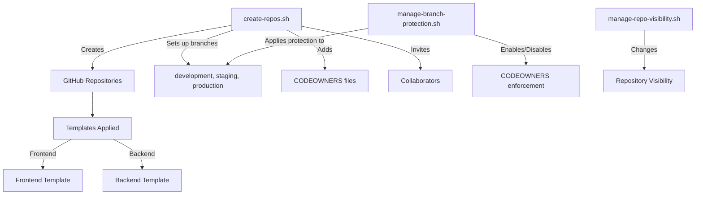

# CloudInsight DevOps Repository Setup

<div align="center">


</div>

This directory contains automation tools for setting up and managing CloudInsight repositories in the AmaliTech-Training-Academy organization. These tools help standardize repository structures, enforce best practices, and simplify repository management tasks.

## 📋 Contents

- [Directory Structure](#directory-structure)
- [Repository Setup Scripts](#repository-setup-scripts)
  - [create-repos.sh](#create-repossh)
  - [manage-branch-protection.sh](#manage-branch-protectionsh)
  - [manage-repo-visibility.sh](#manage-repo-visibilitysh)
- [CODEOWNERS Configuration](#codeowners-configuration)
- [Templates](#templates)
- [Best Practices](#best-practices)
- [Troubleshooting](#troubleshooting)

## 📁 Directory Structure

```
dev-repo-setup/
├── branch-codeowners/        # CODEOWNERS templates for different branches
│   ├── CODEOWNERS.production
│   └── CODEOWNERS.staging
├── scripts/                  # Repository management automation scripts
│   ├── branch-protection-rules.txt
│   ├── create-repos.sh
│   ├── manage-branch-protection.sh
│   └── manage-repo-visibility.sh
└── templates/                # Repository templates
    ├── backend/
    │   ├── .github/
    │   │   └── workflows/
    │   │       └── ci.yml
    │   └── README.md
    └── frontend/
        ├── .github/
        │   └── workflows/
        │       └── ci.yml
        └── README.md
```

## 🚀 Repository Setup Scripts

### create-repos.sh

<details>
<summary><b>Click to expand detailed documentation</b></summary>

#### Description

This script creates and configures repositories in the AmaliTech-Training-Academy organization according to standardized patterns. It sets up branch structures, applies CODEOWNERS files, invites collaborators, and configures CI/CD workflows.

#### Features

- Creates repositories with appropriate templates (frontend/backend)
- Creates three branches with harmonized commit history: development (default), staging, production
- Applies branch-specific CODEOWNERS without causing divergence notifications
- Renames main → development (efficient branch management)
- Invites collaborators and codeowners with appropriate permissions
- Applies .github/workflows/ci.yml for CI pipeline
- Customizes README.md with repository name

#### Usage

```bash
./create-repos.sh [--help]
```

#### Options

| Option   | Description       |
| -------- | ----------------- |
| `--help` | Show help message |

#### Repository Configuration

Repositories are defined in the script using an array in the format:

```bash
REPOS=(
  "repo-name:type"  # where type is either "frontend" or "backend"
)
```

To add new repositories, simply edit the REPOS array in the script.

#### Collaborator Management

The script defines collaborators for each repository type:

- **Frontend collaborators**: Users who have write access to frontend repositories
- **Backend collaborators**: Users who have write access to backend repositories
- **Frontend codeowners**: Users who must approve changes to frontend repositories
- **Backend codeowners**: Users who must approve changes to backend repositories
- **Universal codeowners**: Users who have codeowner status across all repositories

#### Branch Protection Strategy

The script implements a strategic approach to branch protection:

1. Sets up development, staging, and production branches
2. Applies branch-specific CODEOWNERS files
3. Uses .gitignore to prevent CODEOWNERS changes from causing branch divergence
4. Ensures commit history remains harmonized across branches

#### Prerequisites

- GitHub CLI (`gh`) installed and authenticated
- Git installed
- Admin access to create repositories in the organization

</details>

### manage-branch-protection.sh

<details>
<summary><b>Click to expand detailed documentation</b></summary>

#### Description

This script manages branch protection rules for CloudInsight repositories. It can enable or disable branch protection with CODEOWNERS enforcement across multiple repositories and branches.

#### Features

- View current branch protection status
- Enable branch protection with CODEOWNERS enforcement
- Remove branch protection rules
- Target specific repositories or apply to all
- Preserves existing status checks when applying protection

#### Usage

```bash
./manage-branch-protection.sh [OPTION]
```

#### Options

| Option        | Description                    |
| ------------- | ------------------------------ |
| `--help`      | Show help message              |
| `--status`    | Show current protection status |
| `--enable`    | Enable branch protection rules |
| `--disable`   | Remove branch protection rules |
| `--repo REPO` | Operate on specific repository |

#### Examples

```bash
# Show current protection status
./manage-branch-protection.sh --status

# Enable protection for all repositories
./manage-branch-protection.sh --enable

# Enable protection for a specific repository
./manage-branch-protection.sh --enable --repo cloudinsight-frontend-rw

# Remove protection for all repositories
./manage-branch-protection.sh --disable
```

#### Protection Rules Applied

All branches (development, staging, production) receive these protections:

1. **Pull Request Requirements**:

   - 1 approval required for all branches
   - Code owner reviews required (CODEOWNERS enforcement)
   - Dismiss stale reviews when new commits are pushed
   - Require resolution of conversation threads before merging

2. **Status Check Requirements**:

   - Require status checks to pass before merging
   - Require branches to be up-to-date before merging (strict setting)

3. **Branch Restrictions**:

   - Block force pushes
   - Block branch deletions
   - No branch restrictions (anyone with write access can push)

4. **Admin Enforcement**:
   - Not enforced for repository administrators

#### Prerequisites

- GitHub CLI (`gh`) installed and authenticated
- Admin access to the repositories in the organization

</details>

### manage-repo-visibility.sh

<details>
<summary><b>Click to expand detailed documentation</b></summary>

#### Description

This script manages the visibility (public/private) of CloudInsight repositories. It can change visibility for all repositories or target specific ones.

#### Features

- View current visibility status for all repositories
- Make repositories public (with confirmation prompt)
- Make repositories private
- Target specific repositories or apply to all

#### Usage

```bash
./manage-repo-visibility.sh [OPTION]
```

#### Options

| Option        | Description                    |
| ------------- | ------------------------------ |
| `--help`      | Show help message              |
| `--status`    | Show current visibility status |
| `--public`    | Make repositories public       |
| `--private`   | Make repositories private      |
| `--repo REPO` | Operate on specific repository |

#### Examples

```bash
# Show current visibility status
./manage-repo-visibility.sh --status

# Make all repositories private
./manage-repo-visibility.sh --private

# Make a specific repository public
./manage-repo-visibility.sh --public --repo cloudinsight-frontend-rw
```

#### Safety Features

- Confirmation prompts before making repositories public
- Clear warnings about public visibility implications
- Validation of repository existence before attempting changes

#### Prerequisites

- GitHub CLI (`gh`) installed and authenticated
- Admin access to the repositories in the organization

</details>

## 🔒 CODEOWNERS Configuration

<details>
<summary><b>Click to expand detailed documentation</b></summary>

The `branch-codeowners` directory contains CODEOWNERS templates for different branches:

### CODEOWNERS.staging

This template defines ownership rules for the staging branch:

```
# Staging branch code owners
# .github folder managed by bikaze
/.github/ @bikaze

# All other files managed by the staging owner
* @sntakirutimana72
```

### CODEOWNERS.production

This template defines ownership rules for the production branch:

```
# Production branch code owners
# Everything managed by production owner
* @bikaze
```

### Development Branch CODEOWNERS

Development branch CODEOWNERS files are created dynamically by the `create-repos.sh` script based on repository type:

#### Frontend Repositories

```
# Development branch code owners - Frontend
# .github folder managed by bikaze
/.github/ @bikaze

# Everything else managed by frontend team
* @bencyubahiro77 @aimerukundo @tharcissie
```

#### Backend Repositories

```
# Development branch code owners - Backend
# .github folder managed by bikaze
/.github/ @bikaze

# Everything else managed by backend team
* @nkbtemmy2 @bumlev
```

</details>

## 📝 Templates

<details>
<summary><b>Click to expand detailed documentation</b></summary>

The `templates` directory contains standardized templates for frontend and backend repositories:

### Frontend Templates

- **README.md**: A standard README template for frontend repositories
- **.github/workflows/ci.yml**: Continuous Integration workflow for frontend projects

### Backend Templates

- **README.md**: A standard README template for backend repositories
- **.github/workflows/ci.yml**: Continuous Integration workflow for backend projects

These templates are applied during repository creation to ensure consistency across all CloudInsight repositories.

</details>

## 🌟 Best Practices

<details>
<summary><b>Click to expand detailed documentation</b></summary>

### Repository Structure

- Always use the standard 3-branch structure: development, staging, production
- Make development the default branch
- Apply appropriate CODEOWNERS for each branch

### Workflow

1. Developers work on the development branch
2. Changes are promoted to staging for testing
3. After approval, changes are promoted to production

### Branch Protection

- Always enable branch protection with CODEOWNERS enforcement
- Require at least 1 reviewer for all branches
- Require status checks to pass before merging

### Repository Visibility

- Keep repositories private by default
- Only make repositories public after careful consideration
- When making repositories public, ensure sensitive information is removed

</details>

## ❓ Troubleshooting

<details>
<summary><b>Click to expand troubleshooting guide</b></summary>

### Common Issues

#### "Contact the owner of the repository to enable CODEOWNERS."

**Solution:** Run the `manage-branch-protection.sh` script to enable branch protection with CODEOWNERS enforcement:

```bash
./manage-branch-protection.sh --enable
```

#### Failed Collaborator Invitations

**Solution:** Check the GitHub organization settings to ensure:

1. Outside collaborator restrictions are not preventing invitations
2. The organization allows repository creation and invitations

#### GitHub CLI Authentication Issues

**Solution:** Re-authenticate using:

```bash
gh auth login
```

#### Branch Protection Cannot Be Applied

**Solution:**

1. Ensure you have admin access to the repository
2. Check if the branch exists
3. Verify CODEOWNERS file is properly formatted

</details>

## 🔄 Script Interaction Flow

The following diagram shows how the different scripts interact with GitHub repositories:



---

<div align="center">
<p>Developed with ❤️ by the CloudInsight DevOps Team</p>
</div>
