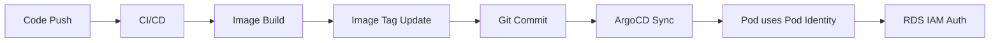

# GitOps Application Repository Structure

This is how your **separate application manifests repository** should be structured for GitOps deployment with RDS IAM authentication.

## Repository Structure

```
myapp-k8s-manifests/
├── environments/
│   ├── dev/
│   │   ├── kustomization.yaml
│   │   └── deployment-patch.yaml
│   ├── staging/
│   │   ├── kustomization.yaml
│   │   └── deployment-patch.yaml
│   └── prod/
│       ├── kustomization.yaml
│       └── deployment-patch.yaml
├── base/
│   ├── deployment.yaml
│   ├── service.yaml
│   ├── serviceaccount.yaml
│   ├── externalsecret.yaml
│   └── kustomization.yaml
└── argocd/
    ├── dev-app.yaml
    ├── staging-app.yaml
    └── prod-app.yaml
```

## Base Manifests

### Service Account

**`base/serviceaccount.yaml`**

```yaml
apiVersion: v1
kind: ServiceAccount
metadata:
  name: myapp-sa
  namespace: default
  labels:
    app.kubernetes.io/name: myapp
    app.kubernetes.io/component: backend
# Note: No annotations needed for Pod Identity (unlike IRSA)
```

### External Secret Configuration

**`base/externalsecret.yaml`**

```yaml
apiVersion: external-secrets.io/v1beta1
kind: ExternalSecret
metadata:
  name: myapp-db-config
  namespace: default
spec:
  refreshInterval: 5m
  secretStoreRef:
    name: aws-parameter-store
    kind: SecretStore
  target:
    name: myapp-db-config
    creationPolicy: Owner
  data:
  - secretKey: DB_HOST
    remoteRef:
      key: /myapp/database/host
  - secretKey: DB_PORT
    remoteRef:
      key: /myapp/database/port
  - secretKey: DB_NAME
    remoteRef:
      key: /myapp/database/name
  - secretKey: DB_USERNAME
    remoteRef:
      key: /myapp/database/username
---
apiVersion: v1
kind: ConfigMap
metadata:
  name: myapp-config
  namespace: default
data:
  USE_IAM_AUTH: "true"
  LOG_LEVEL: "info"
```

### Application Deployment

**`base/deployment.yaml`**

```yaml
apiVersion: apps/v1
kind: Deployment
metadata:
  name: myapp
  namespace: default
  labels:
    app.kubernetes.io/name: myapp
    app.kubernetes.io/component: backend
spec:
  replicas: 2
  selector:
    matchLabels:
      app.kubernetes.io/name: myapp
      app.kubernetes.io/component: backend
  template:
    metadata:
      labels:
        app.kubernetes.io/name: myapp
        app.kubernetes.io/component: backend
    spec:
      serviceAccountName: myapp-sa
      containers:
      - name: myapp
        image: myapp:latest
        ports:
        - containerPort: 8080
          name: http
        env:
        # AWS Region for IAM auth
        - name: AWS_REGION
          value: "us-west-2"  # Will be overridden by Kustomize
        # Database config from External Secret
        - name: DB_HOST
          valueFrom:
            secretKeyRef:
              name: myapp-db-config
              key: DB_HOST
        - name: DB_PORT
          valueFrom:
            secretKeyRef:
              name: myapp-db-config
              key: DB_PORT
        - name: DB_NAME
          valueFrom:
            secretKeyRef:
              name: myapp-db-config
              key: DB_NAME
        - name: DB_USERNAME
          valueFrom:
            secretKeyRef:
              name: myapp-db-config
              key: DB_USERNAME
        # App config from ConfigMap
        - name: USE_IAM_AUTH
          valueFrom:
            configMapKeyRef:
              name: myapp-config
              key: USE_IAM_AUTH
        - name: LOG_LEVEL
          valueFrom:
            configMapKeyRef:
              name: myapp-config
              key: LOG_LEVEL
        livenessProbe:
          httpGet:
            path: /health
            port: 8080
          initialDelaySeconds: 30
          periodSeconds: 10
        readinessProbe:
          httpGet:
            path: /ready
            port: 8080
          initialDelaySeconds: 5
          periodSeconds: 5
        resources:
          requests:
            cpu: "100m"
            memory: "128Mi"
          limits:
            cpu: "500m"
            memory: "512Mi"
        securityContext:
          allowPrivilegeEscalation: false
          readOnlyRootFilesystem: true
          runAsNonRoot: true
          runAsUser: 1000
          capabilities:
            drop:
            - ALL
```

### Service Configuration

**`base/service.yaml`**

```yaml
apiVersion: v1
kind: Service
metadata:
  name: myapp-service
  namespace: default
  labels:
    app.kubernetes.io/name: myapp
    app.kubernetes.io/component: backend
spec:
  type: ClusterIP
  ports:
  - port: 80
    targetPort: 8080
    protocol: TCP
    name: http
  selector:
    app.kubernetes.io/name: myapp
    app.kubernetes.io/component: backend
```

### Base Kustomization

**`base/kustomization.yaml`**

```yaml
apiVersion: kustomize.config.k8s.io/v1beta1
kind: Kustomization

resources:
- serviceaccount.yaml
- externalsecret.yaml
- deployment.yaml
- service.yaml

commonLabels:
  app.kubernetes.io/name: myapp
  app.kubernetes.io/part-of: myapp-system

images:
- name: myapp
  newTag: latest
```

## Environment Overlays

### Development Environment

**`environments/dev/kustomization.yaml`**

```yaml
apiVersion: kustomize.config.k8s.io/v1beta1
kind: Kustomization

namespace: myapp-dev

resources:
- ../../base

patchesStrategicMerge:
- deployment-patch.yaml

configMapGenerator:
- name: myapp-config
  behavior: merge
  literals:
  - LOG_LEVEL=debug
  - ENVIRONMENT=development

images:
- name: myapp
  newTag: v0.1.0-dev.1

replicas:
- name: myapp
  count: 1
```

**`environments/dev/deployment-patch.yaml`**

```yaml
apiVersion: apps/v1
kind: Deployment
metadata:
  name: myapp
spec:
  template:
    spec:
      containers:
      - name: myapp
        env:
        - name: AWS_REGION
          value: "us-west-2"
        resources:
          requests:
            cpu: "50m"
            memory: "64Mi"
          limits:
            cpu: "200m"
            memory: "256Mi"
```

### Production Environment

**`environments/prod/kustomization.yaml`**

```yaml
apiVersion: kustomize.config.k8s.io/v1beta1
kind: Kustomization

namespace: myapp-prod

resources:
- ../../base

patchesStrategicMerge:
- deployment-patch.yaml

configMapGenerator:
- name: myapp-config
  behavior: merge
  literals:
  - LOG_LEVEL=warn
  - ENVIRONMENT=production

images:
- name: myapp
  newTag: v1.0.0

replicas:
- name: myapp
  count: 3
```

**`environments/prod/deployment-patch.yaml`**

```yaml
apiVersion: apps/v1
kind: Deployment
metadata:
  name: myapp
spec:
  template:
    spec:
      containers:
      - name: myapp
        env:
        - name: AWS_REGION
          value: "us-west-2"
        resources:
          requests:
            cpu: "200m"
            memory: "256Mi"
          limits:
            cpu: "1000m"
            memory: "1Gi"
```

## ArgoCD Applications

### Development Application

**`argocd/dev-app.yaml`**

```yaml
apiVersion: argoproj.io/v1alpha1
kind: Application
metadata:
  name: myapp-dev
  namespace: argocd
  finalizers:
  - resources-finalizer.argocd.argoproj.io
spec:
  project: default
  source:
    repoURL: https://github.com/your-org/myapp-k8s-manifests.git
    targetRevision: HEAD
    path: environments/dev
  destination:
    server: https://kubernetes.default.svc
    namespace: myapp-dev
  syncPolicy:
    automated:
      prune: true
      selfHeal: true
      allowEmpty: false
    syncOptions:
    - CreateNamespace=true
    - PrunePropagationPolicy=foreground
    - PruneLast=true
    retry:
      limit: 5
      backoff:
        duration: 5s
        factor: 2
        maxDuration: 3m
```

### Production Application

**`argocd/prod-app.yaml`**

```yaml
apiVersion: argoproj.io/v1alpha1
kind: Application
metadata:
  name: myapp-prod
  namespace: argocd
  finalizers:
  - resources-finalizer.argocd.argoproj.io
spec:
  project: default
  source:
    repoURL: https://github.com/your-org/myapp-k8s-manifests.git
    targetRevision: HEAD
    path: environments/prod
  destination:
    server: https://kubernetes.default.svc
    namespace: myapp-prod
  syncPolicy:
    # Manual sync for production
    syncOptions:
    - CreateNamespace=true
    - PrunePropagationPolicy=foreground
    - PruneLast=true
    retry:
      limit: 5
      backoff:
        duration: 5s
        factor: 2
        maxDuration: 3m
```

## Workflow Overview

### Team Responsibilities

#### 1. Infrastructure Team (Terraform)
- Deploys RDS with IAM auth enabled
- Creates Pod Identity associations
- Sets up External Secrets Operator
- Stores DB connection info in Parameter Store

#### 2. Application Team (GitOps repo)
- Maintains Kubernetes manifests
- Uses External Secrets to fetch DB config
- Leverages Pod Identity for RDS IAM auth
- ArgoCD Image Updater updates image tags

### 3. Deployment Flow



**Step-by-step process:**
1. **Code Push** → CI/CD pipeline triggered
2. **Image Build** → New container image created
3. **Image Tag Update** → ArgoCD Image Updater updates manifest
4. **Git Commit** → Changes committed to GitOps repo
5. **ArgoCD Sync** → ArgoCD deploys updated manifests
6. **Pod Identity** → Pod assumes IAM role automatically
7. **RDS IAM Auth** → Application connects to database securely

## Key Benefits

- **Separation of Concerns**: Infrastructure and application teams work independently
- **Secure Database Access**: No passwords stored, uses IAM authentication
- **Environment Consistency**: Kustomize ensures consistent deployments across environments
- **GitOps Best Practices**: Declarative, version-controlled infrastructure
- **Automated Deployments**: ArgoCD handles continuous delivery
- **Security**: Pod Identity eliminates need for service account annotations

This structure keeps infrastructure and application concerns separated while enabling secure, passwordless database access!